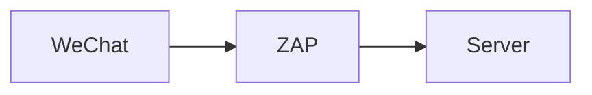

<!--
  Replace asset link with following on Chinese Platforms:
  https://github.com/mincong-h/mincong-h.github.io/raw/master/
 -->

## 前言

如果你在中国出生或居住，那么你对微信一定不陌生。微信是一款由腾讯开发的中国即时通讯、社交媒体和移动支付应用。但你是否曾经想过：使用微信时，网络层面会发生什么？它与服务器之间有哪些交互？为什么作为海外华人，使用微信有时会很慢？在本文中，我们将探讨这些问题，重点关注网络部分。在这篇文章中，我将使用我的个人账户进行测试，并记录观察到的现象。

阅读本文后，你将了解到微信使用的主要网站，HTTP 请求的典型路由是怎样的，中国大陆和海外的 DNS 配置差异，腾讯的 ICP 许可证以及他们的专有协议 mmTLS。希望这能帮助你更多地了解网络故障排除和更多地了解腾讯云。需要注意的是，我目前居住在法国巴黎，因此观察到的情况可能与你的情况有所不同。现在，让我们开始吧！

## 环境

测试使用以下硬件和软件进行：

软件/硬件 | 评论
:--- | :---
Apple MacBook Pro (13-inch, 2019) | 运行测试的计算机
WeChat MacOS (3.8.0) | 待测试的目标应用程序
OWASP Zed Attack Proxy (2.12.0) | 主要用于拦截 HTTP 流量
Wireshark - Network Protocol Analyzer (4.0.6) | 主要用于拦截非 HTTP 流量，特别是 mmTLS 协议
`traceroute` (1.4a12+Darwin) | 主要用于追踪客户端和服务器之间的路由
`host` (9.10.6) | 主要用于了解域名的 DNS 设置
Ip2Location (<https://www.ip2location.com>) | 主要用于了解 IP 地址的服务器信息

## 设置ZAP

为了了解它与服务器有什么样的互动，我们需要拦截流量。在这里，我正在使用流行的OWASP 攻击代理Zed Attack Proxy（ZAP）来做这件事。我是通过将我的微信应用程序连接到运行在localhost 8080端口的ZAP代理来实现的。

ZAP是所谓的 "中间人代理"，它站在客户端和服务器之间，因此它可以拦截和检查客户端和服务器之间发送的信息。这种关系可以表达如下。



然而，在默认情况下，它只拦截HTTP流量，不拦截HTTPS请求，因为HTTPS的设计是为了提供双方的安全通信。当客户端与服务器建立HTTPS连接时，它直接启动SSL/TLS握手并建立加密连接。因此，代理不能拦截或修改流量。为了使拦截HTTPS流量成为可能，我通过生成一个根CA并将其导入MacOS的系统密钥链，将ZAP配置为TLS终端代理。然后，我在系统层面上配置了代理，这样所有的流量都将被ZAP拦截，包括微信。

 

现在，如果我在微信中进行一些操作，比如刷新朋友圈，访问官方账号中的文章，或者在搜索栏中搜索一些关键词，等等。我可以看到许多请求被拦截了：


你可以猜测其中一些域名的用途：关键词为 "mp" 的域名可能是指微信小程序，而关键词为 "channels" 的域名可能是指微信小视频。另外，我认为qpic指的是 "QQ图片"，qlogo指的是 "QQ标志"，它作为腾讯集团（以前的QQ）的一部分存储图片和标志。还有很多其他可以探索的，但由于了解所有的域名不是这篇文章的目的，所以点到为止。

## traceroute

现在我们知道了所有域名的全局情况。那么让我们专注于一个HTTP请求，看看它是如何到达目的地的。目前，我在巴黎，所以我想看看微信是如何将巴黎的请求发送到服务器的，服务器在哪里，网络有多复杂。为了回答这些问题，我将使用`traceroute`命令。这是一个计算机网络诊断命令，用于显示可能的路线（路径）和测量数据包在互联网协议（IP）网络中的传输延迟。

下面是我做的一个`traceroute`命令，用于连接到`vweixinthumb.tc.qq.com`网站。

```
➜  ~ traceroute vweixinthumb.tc.qq.com
traceroute: Warning: vweixinthumb.tc.qq.com has multiple addresses; using 101.33.110.25
traceroute to socwxsns.video.qq.com (101.33.110.25), 64 hops max, 52 byte packets
 1  192.168.1.1 (192.168.1.1)  4.393 ms  3.348 ms  4.066 ms
 2  80.10.253.29 (80.10.253.29)  8.648 ms  5.384 ms  4.795 ms
 3  lag-10.nenly00z.rbci.orange.net (80.10.154.194)  8.486 ms  4.518 ms  4.631 ms
 4  ae91-0.ncidf304.rbci.orange.net (193.253.82.102)  5.663 ms  7.221 ms  5.479 ms
 5  ae42-0.niidf302.rbci.orange.net (193.252.159.153)  5.117 ms  6.203 ms  4.632 ms
 6  ae40-0.niidf301.rbci.orange.net (193.252.103.37)  5.207 ms  5.828 ms  5.379 ms
 7  81.253.184.6 (81.253.184.6)  5.208 ms  5.443 ms  5.148 ms
 8  * tatateleglobe-8.gw.opentransit.net (193.251.251.20)  6.442 ms *
 9  * * if-ae-39-2.tcore1.pvu-paris.as6453.net (80.231.246.6)  239.959 ms
10  * * *
11  if-be-7-2.ecore1.emrs2-marseille.as6453.net (195.219.174.8)  329.872 ms  296.726 ms *
12  * * *
13  if-ae-2-2.tcore2.svw-singapore.as6453.net (180.87.12.2)  364.041 ms
	if-be-45-2.ecore2.esin4-singapore.as6453.net (180.87.108.4)  236.217 ms  308.058 ms
14  11.28.188.149 (11.28.188.149)  306.029 ms
	11.28.189.87 (11.28.189.87)  333.742 ms
	11.28.189.85 (11.28.189.85)  377.984 ms
15  * * *
16  * * *
17  * * *
```

Traceroute追踪一个IP数据包在一个或多个网络中的路径。在上述例子中，它在到达目的地`vweixinthumb.tc.qq.com`之前经过了14个设备/跳。输出的第一行提供了关于同一域名有多个选择的警告，所以traceroute命令只选择了其中一个，即`101.33.110.25`来执行测试。然后，`traceroute`发现域名`vweixinthumb.tc.qq.com`是`socwxsns.video.qq.com`的一个别名（在DNS服务器中类型为CNAME的记录）。这个追踪最多通过64跳，使用52字节的数据包。

```
 7 81.253.184.6 (81.253.184.6) 5.208 ms 5.443 ms 5.148 ms
 8 * tatateleglobe-8.gw.opentransit.net (193.251.251.20) 6.442 ms *.
```

现在，让我们仔细看看`traceroute`命令所记录的每一跳。每一跳都包含几个信息：跳数、域名、底层IP地址，以及该跳送回的3个响应的往返时间（RTT）。然后，字符星号（`*`）表示该跳在给定的超时时间内没有回应。需要注意的是，有些跳数可能没有回应，或者出于安全原因隐藏了其IP地址。这就是你在一些行中看到星号的原因。

正如你所看到的，在traceroute命令开始时，交换的速度非常快，我在10毫秒内得到了响应，但是从开放中转（第8跳）开始，往返时间（RTT）明显增加。如何解释这种现象呢？为了更好地理解这一点，我用从Ip2Location (<https://www.ip2location.com>）检索到的更多信息来丰富IP地址，涉及地理信息、互联网服务提供商（ISP）和自治系统号码（ASN），并绘制了下图：


从图中可以看出，该请求经过了3个自主系统： AS2278 Orange S.A.、AS5511 Orange S.A.和AS6453 Tata通信（美国）公司。在电信领域，自治系统是指由一个组织或实体运营的、具有共同路由策略的网络或连接网络的集合。它通常以其缩写 "AS"而闻名。每个自治系统都被分配一个独特的识别号码，称为自治系统号码（ASN）。我们的traceroute命令穿过了3个自治系统，其中两个属于Orange S.A.，一个属于Tata Communications (America) Inc。你可以看到，请求所使用的路线并不是真正的最佳路线：请求从巴黎到蓝色海岸，到布列塔尼，到罗纳-阿尔卑斯，回到巴黎，然后再到Tata通信的自治系统。但我想这很难优化，因为不同的自治系统由不同公司运营的。

在第13跳，你可以看到两个结果。它表明在这一跳有多个网络路径或接口可用，并且traceroute显示了每个路径或接口的RTT测量值。这可能发生于各种因素，如网络冗余、负载平衡或不同的路由策略。与第14跳类似。


从上面的traceroute命令中，我们可以总结出：

* 在欧洲国家使用微信有时候会很慢，因为数据不是储存在欧洲，而是储存在新加坡的。
* 在巴黎发请求给腾讯的话，有两家电信公司参与其中：Orange和Tata。

## DNS

下面我们换个方向，研究网络问题的另一个方面：域名系统（DNS）。对于文章中的同一个网址，中国大陆的用户和其他地方的用户看到的内容是否相同？为了回答这个问题，我挑选了在ZAP中发现的一个子域： <https://cmmsns.qpic.cn>，我想知道在不同的地理区域，服务器是在哪里托管的。因此，我挑选了3个DNS服务器：CloudFlare的DNS服务器（1.1.1.1），法国Orange的DNS服务器（80.10.246.2），以及中国百度的DNS服务器（180.76.76.76）。改变DNS很简单，通过改变自己电脑中的网络设置就可以。

下面是使用CloudFlare DNS（1.1.1.1）的结果：

```
➜ ~ dig cmmsns.qpic.cn

; <<>> DiG 9.10.6 <<>> cmmsns.qpic.cn
;; global options: +cmd
;; Got answer:
;; ->>HEADER<<- opcode: QUERY, status: NOERROR, id: 52419
;; flags: qr rd ra; QUERY: 1, ANSWER: 5, AUTHORITY: 0, ADDITIONAL: 1

;; OPT PSEUDOSECTION:
; EDNS: version: 0, flags:; udp: 1232
;; QUESTION SECTION:
;cmmsns.qpic.cn.			IN	A

;; ANSWER SECTION:
cmmsns.qpic.cn.		60	IN	CNAME	mmsns.qpic.wechatos.net.
mmsns.qpic.wechatos.net. 300	IN	A	43.130.30.140
mmsns.qpic.wechatos.net. 300	IN	A	43.130.30.221
mmsns.qpic.wechatos.net. 300	IN	A	43.130.30.120
mmsns.qpic.wechatos.net. 300	IN	A	43.130.30.12

;; Query time: 493 msec
;; SERVER: 1.1.1.1#53(1.1.1.1)
;; WHEN: Sun Jun 04 18:19:43 CEST 2023
;; MSG SIZE  rcvd: 144
```

在这种情况下，子域名`cmmsns.qpic.cn`是一个CNAME记录，是一个别名，指向`mmsns.qpic.wechatos.net`，而后者的主机在美国。这意味着，当我们在微信中打开一篇文章或任何资源时，一些图片可能从美国加载。这可能是缓慢或快速的，取决于你住在哪里。

现在，我切换到法国的Orange DNS（80.10.246.2）：

```
➜ ~ dig cmmsns.qpic.cn

; <<>> DiG 9.10.6 <<>> cmmsns.qpic.cn
;; global options: +cmd
;; Got answer:
;; ->>HEADER<<- opcode: QUERY, status: NOERROR, id: 5407
;; flags: qr rd ra; QUERY: 1, ANSWER: 5, AUTHORITY: 0, ADDITIONAL: 1

;; OPT PSEUDOSECTION:
; EDNS: version: 0, flags:; udp: 1232
;; QUESTION SECTION:
;cmmsns.qpic.cn.			IN	A

;; ANSWER SECTION:
cmmsns.qpic.cn.		46	IN	CNAME	mmsns.qpic.wechatos.net.
mmsns.qpic.wechatos.net. 25	IN	A	43.130.30.120
mmsns.qpic.wechatos.net. 25	IN	A	43.130.30.12
mmsns.qpic.wechatos.net. 25	IN	A	43.130.30.140
mmsns.qpic.wechatos.net. 25	IN	A	43.130.30.221

;; Query time: 14 msec
;; SERVER: 80.10.246.2#53(80.10.246.2)
;; WHEN: Sun Jun 04 18:37:09 CEST 2023
;; MSG SIZE  rcvd: 144
```

数据存储在同一个地方，它仍然指向`mmsns.qpic.wechatos.net`，它的主机在美国。

现在，让我们使用百度DNS服务器（180.76.76.76）：

```
➜ ~ dig cmmsns.qpic.cn

; <<>> DiG 9.10.6 <<>> cmmsns.qpic.cn
;; global options: +cmd
;; Got answer:
;; ->>HEADER<<- opcode: QUERY, status: NOERROR, id: 64007
;; flags: qr rd ra; QUERY: 1, ANSWER: 16, AUTHORITY: 0, ADDITIONAL: 0

;; QUESTION SECTION:
;cmmsns.qpic.cn.			IN	A

;; ANSWER SECTION:
cmmsns.qpic.cn.		190	IN	A	36.248.45.104
cmmsns.qpic.cn.		190	IN	A	36.248.45.105
cmmsns.qpic.cn.		190	IN	A	36.248.45.106
...

;; Query time: 371 msec
;; SERVER: 180.76.76.76#53(180.76.76.76)
;; WHEN: Sun Jun 04 18:21:57 CEST 2023
;; MSG SIZE  rcvd: 288
```

这一次，我得到了一个完全不同的答案：该域名不再是CNAME记录。它是一个A记录，直接指向托管在中国大陆的服务器。例如，根据Ip2Location（<https://www.ip2location.com/36.248.45.104>），结果中的第一个IP地址，即服务器36.248.45.104，托管在中国福建福州，属于自治系统AS4837，由中国联通运营。

这实际上意味着什么呢？这意味着从网站托管的角度来看，中国地区和国际地区使用不同的服务器提供内容，分别托管在中国大陆和美国。即使用了同一个网址，在海外和境内访问的服务器还是不一样的。这样的后台涉及到数据复制的问题。腾讯云提供了多种数据复制的解决方案，可能适合这样的场景，比如在在云对象存储（COS）层面有[跨区域复制（CRR）](https://www.tencentcloud.com/document/product/436/35272?lang=en)，在数据库层面有[数据传输服务（DTS）](https://www.tencentcloud.com/products/dts)，或许还有别的方案。

## ICP许可证

任何在中国提供在线服务的互联网内容提供商（ICP）都需要有ICP备案（ICP许可证）。这是由中国工业和信息化部（MIIT）颁发的许可证。中国网站的ICP许可证号码通常可以在前台网页的底部找到。

根据[阿里云的官方文档](https://www.alibabacloud.com/help/zh/icp-filing/latest/prepare-and-check-the-domain-name)，如果域名的顶级域名没有得到工信部的批准，你就不能为其申请ICP备案。要检查你的域名是否有资格申请ICP备案。以下是由工信部提供的图表。你可以看到，`.cn`是一个国家顶级域名：


现在，让我们检查一下微信使用的一个网站的ICP许可证： `qpic.cn`。如果你去工信部的网站，你可以通过查询域名找到这些信息。所以对于`qpic.cn`，它的许可证是粤B2-20090059，由广东分局授予的。需要注意的是：1）每个地区的规定略有不同，阿里云在其网站上有[每个地区的详细说明](https://www.alibabacloud.com/help/en/icp-filing/latest/read-and-understand-the-icp-regulations)；2）工信部网站的内容只有中文；3）显示结果的链接是无法分享的，因为它并不包含你在搜索栏中输入的查询语句。


## mmTLS

在上面的章节中，我检查了一些基于HTTP/S的流量。然而，我很快意识到，大部分的流量并没有通过HTTP/S。比如说，当一个朋友在聊天中给我发信息时，或者当我刷新 "时刻（朋友圈）"时，等等。这让我很困惑。在阅读了一些研究论文后，我发现腾讯并不依赖HTTP/S进行通信：他们在大多数通信中使用一种名为mmTLS的专有加密协议。它是基于传输层安全（TLS）1.3草案设计的，在性能和安全方面都有保障。

ZAP只能拦截基于HTTP的通信，因此，它不能拦截mmTLS的通信。为了拦截mmTLS，我使用了Wireshark。但由于数据是加密的，我不知道解密的密钥在哪里，所以我无法读取请求或响应的内容。根据Ip2Location，与我互动的服务器（https://www.ip2location.com/162.62.115.23）是一台托管在德国黑森州法兰克福的服务器，位于腾讯的数据中心。


如果你想了解更多关于mmtls的信息，我推荐你阅读GitHub上的这篇文章： [基于TLS1.3的微信安全通信协议mmtls介绍.md](https://github.com/WeMobileDev/article/blob/master/%E5%9F%BA%E4%BA%8ETLS1.3%E7%9A%84%E5%BE%AE%E4%BF%A1%E5%AE%89%E5%85%A8%E9%80%9A%E4%BF%A1%E5%8D%8F%E8%AE%AEmmtls%E4%BB%8B%E7%BB%8D.md)，它的讲解非常详细。

## 结论

在这篇文章中，我们使用两个工具拦截了微信（MacOS）的流量： Zed Attack Proxy（ZAP）和Wireshark。我们看到了我在法国的电脑和新加坡的服务器之间的路由，中国大陆和海外的域名cmmsns.qpic.cn的不同DNS设置，qpic.cn的ICP许可证信息，以及最后一些与mmtls有关的基本信息。有兴趣了解更多吗？欢迎关注我的 GitHub 账号 [mincong-h](https://github.com/mincong-h "GitHub") 或者微信订阅号【码农小黄】。谢谢大家！

## 参考文献

- [How to Use Traceroute to Identify Network Problems](https://www.howtogeek.com/134132/how-to-use-traceroute-to-identify-network-problems/)
- [Network: Underestanding the traceroute output](https://www.lumen.com/help/en-us/network/traceroute/understanding-the-traceroute-output.html)
- [Les adresses DNS des fournisseurs d'accès Internet](https://www.ariase.com/box/dossiers/adresses-dns)
- [What is Traceroute? How It Works and How to Read Results](https://www.varonis.com/blog/what-is-traceroute)
- [Autonomous system (Internet)](https://en.wikipedia.org/wiki/Autonomous_system_%28Internet%29)
- [Ip2Location: Identify Geographical Location and Proxy by IP Address](https://www.ip2location.com/)
- [Prepare and check the domain name - Alibaba Cloud](https://www.alibabacloud.com/help/en/icp-filing/latest/prepare-and-check-the-domain-name)