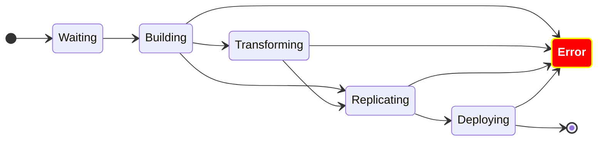

## Overview

_Note: "C" is not the real name of the project, it's just a symbol representing the actual work._

"C" is a new CI/CD tool which automates the continuous delivery at Datadog. It covers all the steps of the software delivery lifecycle changes (SDLC) including build, transformation, replication, and deployment. Compared to the previous version, it removes manual steps between build and deployment, supports deployment with multiple artifacts, contains graphical user interface (GUI) and command line interface (CLI) to operate the tool, hook into a standard service description, provides integration with Slack and GitHub, and more.

The goal of this product is to unify the existing tools related to CI/CD and provide a consistent experience for all internal engineers across all environments, regardless the programming language and regardless the Git repository. It also increased the operability of the CI/CD process by allowing user to operate directly from Slack, GUI, or CLI. My role as a Software Engineer was to participate to the development, especially tasks related to Java services. This product is used by 20+ teams and 100+ services in the Java mono-repository.

## Implementation

At its core, this project uses a state machine to maintain the state of each software development lifecycle (SDLC). It relies on the Go library [qmuntal/stateless](https://github.com/qmuntal/stateless) to create finite state machines (FSM). Here is a diagram representing the main states of the project.

The main flow is to wait to accept signals, then build the artifact, replicate it, transform it, deploy it, and finally mark the conduct as done. If anything goes wrong, it goes to the erroring state. If the user decides to cancel it, it goes to the canceling state. The execution of each SDLC is powered by [Temporal Workflow](https://temporal.io/), a famous open-source workflow engine.

Key technologies: _Golang, Temporal, CLI, API, gRPC, GitLab, Slack, Datadog, Kubernetes, OCI, CNAB_

## Contributions

* Develop the core logic of the state machine with the core team, especially the transformation state
* Develop the CLI with the core team, especially the batch commands
* Onboard the existing CI/CD tools for the Java mono-repository, including config generation, troubleshooting, etc
* Contact users in multiple teams for beta-testing
* Provide documentation for all kinds of purposes: getting-started, technical walkthrough, troubleshooting, etc
* Support and incident handling

