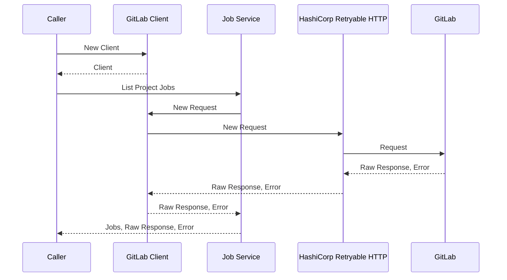

## Introduction

During my daily work at Datadog, I had the chance to use the GitLab Go API
client ([xanzy/go-gitlab](https://github.com/xanzy/go-gitlab)) to interact with
our GitLab server. I feel that the library is well written and I want to learn
how to write a library in the same way. That's why I spent some time studying
its source code and I would like to share it with you today. After reading this
article, you will understand:

- How to use this package
- The structure of the Go package
- The HTTP request and response
- Its dependencies
- The CI pipeline
- Its advanced features
- Publishing the documentation

Now, let's get started!

## Usage

Using the GitLab library is very simple, you need to create a new client with a
token and then use the domain-specific sub-client to access certain resources.
For example, this is the code for listing users, provided by the official
documentation:

```go
import "github.com/xanzy/go-gitlab"

// ...

git, err := gitlab.NewClient("yourtokengoeshere")
if err != nil {
  log.Fatalf("Failed to create client: %v", err)
}
users, _, err := git.Users.ListUsers(&gitlab.ListUsersOptions{})
```

There are a few `With...` option functions that can be used to customize the API
client. For example, to set a custom base URL:

```go
git, err := gitlab.NewClient("yourtokengoeshere", gitlab.WithBaseURL("https://git.mydomain.com/api/v4"))
if err != nil {
  log.Fatalf("Failed to create client: %v", err)
}
users, _, err := git.Users.ListUsers(&gitlab.ListUsersOptions{})
```

We will discuss this more in detail in the following sections.

## Package Structure

The structure of this package is pretty simple, most of the files are located
directly in the root directory of the Git repository. The Go files are grouped
by domain: each domain has 2 files, one for the source code and the other for
the test code, e.g. `access_requests.go` and `access_requests_test.go`.

```
➜  go-gitlab git:(master|u=) tree | head
.
├── LICENSE
├── README.md
├── access_requests.go
├── access_requests_test.go
├── applications.go
├── applications_test.go
├── audit_events.go
├── audit_events_test.go
├── avatar.go
```

Inside each domain, we can find multiple things: the sub-client of this domain; the Go structures
representing the HTTP requests and responses for this domain; and
the related methods. For example, for the domain "jobs"
(`jobs.go`), we can find the `JobsService` which is the client of the domain
"jobs"; we can find the structures: `Job` and `Bridge`; we
can also see the methods for different purposes: listing project jobs, listing
pipeline jobs, listing pipeline bridges, etc.

```go
// JobsService handles communication with the ci builds related methods
// of the GitLab API.
//
// GitLab API docs: https://docs.gitlab.com/ce/api/jobs.html
type JobsService struct {
	client *Client
}

type Job struct {
	Commit            *Commit    `json:"commit"`
	Coverage          float64    `json:"coverage"`
	// ...
}

type Bridge struct {
	Commit             *Commit       `json:"commit"`
	Coverage           float64       `json:"coverage"`
	// ...
}

// ...

func (s *JobsService) ListProjectJobs(...) ([]*Job, *Response, error) { ... }
```

Then, if you want to go further into the HTTP request handling, you will find
out that the actual preparation of the request is not handled by the domain.
It's delegated to the underlying `*Client`, which is a low-level HTTP client
shared by all the domains. Internally, it marshals the Go structure into an HTTP
request, sends the request, waits for the HTTP response, unmarshals it back to
Go structure, and handle eventual errors. To better understand the relationship
between the domain-specific client and the low-level HTTP client, let's draw a
diagram
([excalidraw](https://excalidraw.com/#json=Pys3pvu180BqEIHimIMQr,KWR8EauTyVMsOie7b2h7PA)):


This structure uses the delegation pattern
([wikipedia](https://en.wikipedia.org/wiki/Delegation_pattern)), which allows
reusing the same logic for every domain. Therefore, you don't have to
repeat yourself. It's pretty cool, isn't it?

However, this requires some work. During the initialization of the GitLab Go
client, you need to initialize the low-level client and the high-level clients
correctly as shown below. Inside the `gitlab.go` file, we can see that a new structure is
created for each public service (domain), and the low-level client is wired to
the current client `c`. Without it, the service (domain) cannot handle the HTTP
request correctly.

```go
// file: gitlab.go
func newClient(options ...ClientOptionFunc) (*Client, error) {
	c := &Client{UserAgent: userAgent}

	// Configure the HTTP client.
	// ...

	// Create all the public services.
	c.AccessRequests = &AccessRequestsService{client: c}
	c.Applications = &ApplicationsService{client: c}
	c.AuditEvents = &AuditEventsService{client: c}
	c.Avatar = &AvatarRequestsService{client: c}
	c.AwardEmoji = &AwardEmojiService{client: c}
```

## Request and Response

Thanks to the section above, we have a better overview of the package structure.
However, it's still not clear how the SDK handles an HTTP request
for us. In this section, we are going to discuss it. More precisely, we will use
the "List Project Jobs API" as an example to learn the internal mechanism and
get the exact sequence of the related actions.

Before listing the jobs, you need to instantiate a new GitLab client via the
method `NewClient(...)`. Once it is created, you can list the jobs of a given
project. This is done by invoking the sub-client `client.Jobs`, which represents the
job service of GitLab. This service uses the `ListProjectJobs` to achieve the
goal. Internally, it delegates the logic to the low-level client `*Client` to
perform the HTTP request. The low-level client sets up the headers, marchals the
input Go structure into JSON, then delegates again the actual request to HashiCorp
Retryable HTTP, a third-party library. This library interacts with the GitLab
server and waits for the HTTP response to be returned. Once done, it returns
either the correct response or the error to the upper levels. At the job service
level, if it receives the correct response, it will unmarshal it back to a Go
structure `[]*Job` before returning it to the user.



Now, let's go further into marshaling and unmarshaling. Marshalling happens
when preparing the HTTP request and unmarshaling happens when receiving the
HTTP response. The marshaling process transforms the Go structure into JSON.
For listing the project's jobs, the related Go structure is `ListJobsOptions`.

```go
// file: jobs.go

// ListJobsOptions represents the available ListProjectJobs() options.
//
// GitLab API docs:
// https://docs.gitlab.com/ce/api/jobs.html#list-project-jobs
type ListJobsOptions struct {
	ListOptions
	Scope          *[]BuildStateValue `url:"scope[],omitempty" json:"scope,omitempty"`
	IncludeRetried *bool              `url:"include_retried,omitempty" json:"include_retried,omitempty"`
}
```

The marshaling happens inside the low-level client, where the function
`NewRequest` accepts whatever input option as an interface, and marshals it as the
request body. This is handled by the built-in package "encoding/json" in Go. The
function also sets the media type as "application/json" to let the server knows
the type of content.

```go
// file: gitlab.go
import (
	"bytes"
	"context"
	"encoding/json"
	// ...
)

func (c *Client) NewRequest(method, path string, opt interface{}, options []RequestOptionFunc) (*retryablehttp.Request, error) {
	//...
	var body interface{}
	switch {
	case method == http.MethodPost || method == http.MethodPut:
		reqHeaders.Set("Content-Type", "application/json")

		if opt != nil {
			body, err = json.Marshal(opt)
			if err != nil {
				return nil, err
			}
		}
```

Once the response is received by the client, the unmarshaling process starts.
More precisely, it is initialized in the domain-level client but handled by the
low-level client. Let's take "list project jobs" as an example, the jobs service
declares the variable `var job []*Job` without assigning the variable. This
reference of this variable is passed to the low-level `s.client`. Inside the
low-level client,
it uses the built-in Go package "encoding/json" to unmarshal the HTTP response.
Note that this variable `v` is not returned as part of the function output, because
the assignment happens in place. That is, when we decode the variable `v`, the
caller already has access to this information because both the low-level client
and the caller point to the same reference of `*ListJobsOptions`. You may notice
that the GitLab client also supports I/O stream, which is useful for downloading
resources, such as downloading the artifacts of a job.

```go
// file: jobs.go
func (s *JobsService) ListProjectJobs(pid interface{}, opts *ListJobsOptions, options ...RequestOptionFunc) ([]*Job, *Response, error) {
	// ...
	var jobs []*Job
	resp, err := s.client.Do(req, &jobs)
	if err != nil {
		return nil, resp, err
	}
```

```go
// file: gitlab.go
func (c *Client) Do(req *retryablehttp.Request, v interface{}) (*Response, error) {
	// ...
	if v != nil {
		if w, ok := v.(io.Writer); ok {
			_, err = io.Copy(w, resp.Body)
		} else {
			err = json.NewDecoder(resp.Body).Decode(v)
		}
	}

	return response, err
}
```

## Error Handling

Error handling is an important part of any SDK. In this section, we are going to
discuss how GitLab SDK handles errors. In general, there are two types of
errors: non-API errors and API errors. Non-API errors are errors that are
unrelated to the GitLab APIs. This can happen before sending an
HTTP request. API errors are errors that are related to the GitLab APIs. It means
that the error is provided by the GitLab server with a standard error structure.

The non-API errors happen in the low-level client (`gitlab.go`) where we try to
prepare the HTTP request with a limiter; request an OAuth token; submit an HTTP
request; etc. As you can see, in any of the cases, we don't have a response from
the GitLab Server. It means that the error happens before receiving the response
or even before sending the request.

```go
// Wait will block until the limiter can obtain a new token.
err := c.limiter.Wait(req.Context())
if err != nil {
	return nil, err
}
```

```go
if basicAuthToken == "" {
	// If we don't have a token yet, we first need to request one.
	basicAuthToken, err = c.requestOAuthToken(req.Context(), basicAuthToken)
	if err != nil {
		return nil, err
	}
}
req.Header.Set("Authorization", "Bearer "+basicAuthToken)
```

```go
resp, err := c.client.Do(req)
if err != nil {
	return nil, err
}
```

Now, let's take a look at the API errors. API errors are representations of the
failures returned by the GitLab server. This happens when the request has been
successfully sent but the client received a failing response. According to the
GitLab official documentation ["Data validation and error
reporting"](https://docs.gitlab.com/ee/api/index.html#data-validation-and-error-reporting),
the structure of the error message can be described as follows:

```json
{
    "message": {
        "<property-name>": [
            "<error-message>",
            "<error-message>",
            ...
        ],
        "<embed-entity>": {
            "<property-name>": [
                "<error-message>",
                "<error-message>",
                ...
            ],
        }
    }
}
```

In the GitLab client SDK, it parses the error following exactly this structure
via the function `parseError(...)`.
If we take a step back, an API error is created in the following way. If the
HTTP response is successful or cached, it is not considered as an error. Else,
we retrieve the response body as bytes and parse it. The parsing logic is split
into 2 steps: 1) we verify if this is a valid JSON format by unmarshaling it
via the `json.Unmarshal` function; 2) then, we parse the fields one by one and
create a string representation of the error. Finally, the function returns a
reference of the structure `*ErrorResponse`, which encapsulates both the raw
HTTP response `r` and the string representation of the error message.

```go
// CheckResponse checks the API response for errors, and returns them if present.
func CheckResponse(r *http.Response) error {
	switch r.StatusCode {
	case 200, 201, 202, 204, 304:
		return nil
	}

	errorResponse := &ErrorResponse{Response: r}
	data, err := io.ReadAll(r.Body)
	if err == nil && data != nil {
		errorResponse.Body = data

		var raw interface{}
		if err := json.Unmarshal(data, &raw); err != nil {
			errorResponse.Message = fmt.Sprintf("failed to parse unknown error format: %s", data)
		} else {
			errorResponse.Message = parseError(raw)
		}
	}

	return errorResponse
}
```

## Dependency

In the previous section, we focused on one single request and studied the
sequence of the actions. Now, let's change an angle and look at its
dependencies. Below is the `go.mod` file which describes the module's
properties, including its dependencies.

```go
module github.com/xanzy/go-gitlab

go 1.18

require (
	github.com/google/go-querystring v1.1.0
	github.com/hashicorp/go-cleanhttp v0.5.2
	github.com/hashicorp/go-retryablehttp v0.7.1
	github.com/stretchr/testify v1.8.0
	golang.org/x/oauth2 v0.0.0-20220722155238-128564f6959c
	golang.org/x/time v0.0.0-20220722155302-e5dcc9cfc0b9
)

require (
	github.com/davecgh/go-spew v1.1.1 // indirect
	github.com/golang/protobuf v1.5.2 // indirect
	github.com/pmezard/go-difflib v1.0.0 // indirect
	golang.org/x/net v0.0.0-20220805013720-a33c5aa5df48 // indirect
	google.golang.org/appengine v1.6.7 // indirect
	google.golang.org/protobuf v1.28.1 // indirect
	gopkg.in/yaml.v3 v3.0.1 // indirect
)
```

Here is a brief analysis of each direct dependency:

* `github.com/google/go-querystring` is used for constructing query parameters
  for HTTP requests. This is useful for URL encoding.
* `github.com/hashicorp/go-cleanhttp` is used for setting up the HTTP client used by
  the retryable http client. In particular, it sets up a connection pool for the
  client.
* `github.com/hashicorp/go-retryablehttp` is used for handling the retry
  mechansim for the http requests.
* `github.com/stretchr/testify` is used for writing tests.
* `golang.org/x/oauth2` is used for handling open authorization (OAuth).
* `golang.org/x/time` is used for facilitating operations related to
  datetime.

As for the indirect dependencies, they are dependencies used by the direct
dependencies mentioned above. They are transitive dependencies. See
["//indirect for a dependency in go.mod file in Go (Golang)"](https://golangbyexample.com/indirect-dependency-golang/) to learn more
about this.

## CI

Continuous integration also plays an important part in the success of the
project. It allows maintainers to focus on what matters and reduce the burden.
This GitLab SDK uses GitHub actions to run linting and tests. It is configured to
test the 3 major Go versions: 1.18, 1.19, and the latest one.

```yaml
    name: Lint and Test - ${{ matrix.go-version }}
    strategy:
      matrix:
        go-version: [1.18.x, 1.19.x, 1.x]
        platform: [ubuntu-latest]
    runs-on: ${{ matrix.platform }}
```

The lint is handled by the Golang CI lint action and the tests are handled by
the built-in `go test` command, which traverses the repository recursively with
coverage measurement enabled.

```yaml
      - name: Test package
        run: |
          go test -v ./... -coverprofile=coverage.txt -covermode count
          go tool cover -func coverage.txt
```

## Advanced Features

The GitLab Go SDK also contains some advanced features that we didn't have
a chance to discuss so far, such as its retry mechanism, pagination, and
its option functions. Here, I want to briefly talk about them.

**Retry mechanism.** According to [HashiCorp's official
documentation](https://github.com/hashicorp/go-retryablehttp), _"the
`retryable` package provides a familiar HTTP client interface with automatic
retries and exponential backoff. It's a thin wrapper over the standard
`net/http` client library and exposes nearly the same public API. This makes
`retryablehttp` very easy to drop into existing programs."_. The retry mechanism
is triggered automatically under certain conditions, such as when a connection
error occurred, or a 500-range response is received (except 501 Not Implemented).
Some of the configurations are exposed as a client option function, where you can
customize your GitLab client as you want. Below, you can see an example that
allows you to configure a custom backoff policy:

```go
// file: client_options.go

// WithCustomBackoff can be used to configure a custom backoff policy.
func WithCustomBackoff(backoff retryablehttp.Backoff) ClientOptionFunc {
	return func(c *Client) error {
		c.client.Backoff = backoff
		return nil
	}
}
```

There are also options to configure the maximum number of retries, the retry
policy, the logger, etc.

**Pagination.** GitLab supports two types of pagination methods: offset-based
pagination and keyset-based pagination
([documentation](https://docs.gitlab.com/ee/api/#pagination)). The offset-based
pagination is supported by the GitLab API Go client. This is achieved by two
pieces of code: the listing options in the request and the pagination-related
info in the response. More precisely, when listing some resources, you can
specify the offset and the limit of your pagination via the `ListOptions`
structure using variables "Page" and "PerPage". When returning the HTTP response,
the SDK uses a wrapper structure around the built-in HTTP response to contain
the information related to pagination.

```go
// file: gitlab.go

// ListOptions specifies the optional parameters to various List methods that
// support pagination.
type ListOptions struct {
	// For paginated result sets, page of results to retrieve.
	Page int `url:"page,omitempty" json:"page,omitempty"`

	// For paginated result sets, the number of results to include per page.
	PerPage int `url:"per_page,omitempty" json:"per_page,omitempty"`
}

// ...

// Response is a GitLab API response. This wraps the standard http.Response
// returned from GitLab and provides convenient access to things like
// pagination links.
type Response struct {
	*http.Response

	// These fields provide the page values for paginating through a set of
	// results. Any or all of these may be set to the zero value for
	// responses that are not part of a paginated set, or for which there
	// are no additional pages.
	TotalItems   int
	TotalPages   int
	ItemsPerPage int
	CurrentPage  int
	NextPage     int
	PreviousPage int
}
```

But isn't the response being transformed into the actual Go structure before
returning to the caller? Well, actually both of them are returned: not only the
actual Go structure but also the wrapped HTTP response. Below, you can see an
example from "listing project jobs":

```go
func (s *JobsService) ListProjectJobs(
	pid interface{},
	opts *ListJobsOptions,
	options ...RequestOptionFunc) ([]*Job, *Response, error) { ... }
```

**Option Functions.** The GitLab SDK provides some `With...` option functions to
let you customize the API client. Why? Because the default values may not fit
100% of your need and you want to do something differently. This notion is
probably introduced by Dave Cheney in his post ["Functional options for friendly
APIs"](https://dave.cheney.net/2014/10/17/functional-options-for-friendly-apis)
back to 2014. The main benefits of using functional options are: letting you
write beautiful APIs that can grow over time; enabling the default use case to be
its simplest; giving more readable and meaningful parameters; and providing direct
control over the initialization of complex values.

The GitLab API client provides options to set the base URL, configure backoff policy, logging,
error handling, HTTP client, etc.

```go
git, err := gitlab.NewClient("yourtokengoeshere", gitlab.WithBaseURL("https://git.mydomain.com/api/v4"))
if err != nil {
  log.Fatalf("Failed to create client: %v", err)
}
users, _, err := git.Users.ListUsers(&gitlab.ListUsersOptions{})
```

Using the `With...` style functions to configure options is common in Go. You
can see similar patterns in gRPC when creating a client connection to the given
target ([doc](https://pkg.go.dev/google.golang.org/grpc#Dial)). For example:

```go
conn, err := grpc.Dial(addr,
	grpc.WithTransportCredentials(insecure.NewCredentials()),
	grpc.WithChainUnaryInterceptor(myInterceptor),
	// ...
)
```

Or simply changing the context using the builtin `context` library to inject new
key value pair, setting timeout, etc as mentioned by Kshitij Kumar in his
article ["Notes: Golang Context"](https://btree.dev/golang-context):

```go
ctx := context.WithValue(context.Background(), "my_key", "my_value")
```

```go
// context with deadline after 2 millisecond
ctx, cancel := context.WithTimeout(context.Background(), 2*time.Millisecond)
```

## Documentation

As many other open-source projects written in Go, the documentation of this SDK
is published to [Go package repository](https://pkg.go.dev) under
<https://pkg.go.dev/github.com/xanzy/go-gitlab>.


The documentation is probably published manually to the Go package repository
because I don't see integration in the CI. It should be very simple, the Go
official website has instructions about the publishing process
[here](https://go.dev/doc/modules/publishing).

## Conclusion

In this article, we went into the implementation of the GitLab API Go client and
learned about different aspects of this library, including the package
structure, the request and response, the error handling, its dependency, the CI
pipeline, its advanced features (retry mechanism, pagination, client options),
and its documentation. I hope that it gives a better understanding of this
library, gives you ideas for troubleshooting, or inspires you to write your
SDK!
Interested to know more? You can subscribe to [the feed of my blog](/feed.xml), follow me
on [Twitter](https://twitter.com/mincong_h) or
[GitHub](https://github.com/mincong-h/). Hope you enjoy this article, see you the next time!

_P.S. Special thanks to [Giorgos Georgiou](https://github.com/behos) for
reviewing this post._

## References

- [Sequence Diagram Tutorial – Complete Guide with Examples](https://creately.com/blog/diagrams/sequence-diagram-tutorial/)
- [Sequence Diagram -
  Mermaid](https://mermaid-js.github.io/mermaid/#/sequenceDiagram)
- [//indirect for a dependency in go.mod file in Go (Golang)](https://golangbyexample.com/indirect-dependency-golang/)
- [github.com/xanzy/go-gitlab](https://pkg.go.dev/github.com/xanzy/go-gitlab)
- [Publishing a module - Go](https://go.dev/doc/modules/publishing)
- [Web API Pagination | Offset-based vs Cursor-based - Ambient
  Coder](https://youtu.be/WUICbOOtAic)
- [API Docs - GitLab](https://docs.gitlab.com/ee/api/)
