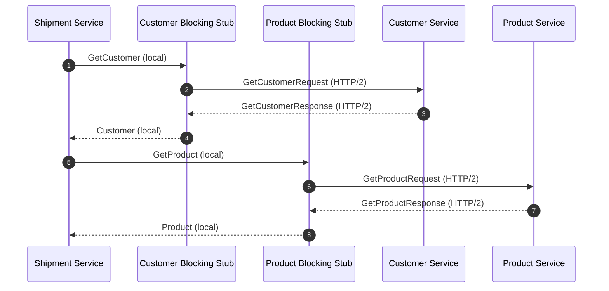
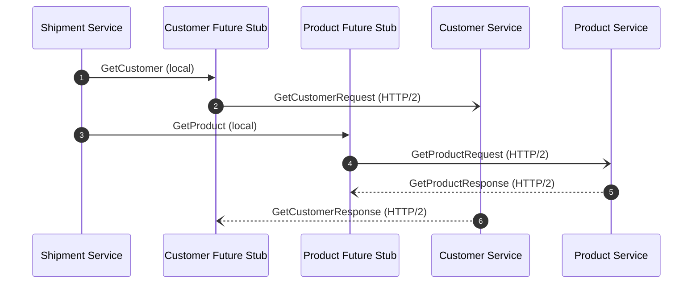

## Introduction

Inter-process communication (IPC) refers to the mechanisms an operating system provides to allow processes to communicate with each other. Different forms of IPC include pipes, message queues, semaphores, and shared memory. These mechanisms enable processes to share data, synchronize their actions, and communicate with each other in a coordinated manner. Inside a microservices architecture, diffrent service instances are typically running on different machines, which requires remote communication. That's why it's important to understand different types of interaction styles in such scenario. In this article, we are going to explore gRPC, one of the commonly used framework.

After reading this article, you will understand:

- What are the different communication styles
- What is gRPC
- Service definition using Protocol Bufferes (protobuf)
- gRPC compiler for code generation
- gRPC lifecycle
- gRPC tools to help troubleshooting
- Real-world scenarios using gRPC
- How to go further from here

Now, let's get started!

## Communication Styles

Before talking about gRPC, we need to see the big picture of microservices communication, to better understand in which cases can gRPC fit. The communication styles can mainly grouped into two dimensions: the service relationship and the synchronization.

When a service sends a message, the message can be either received by one or multiple services.

* **One-to-one** -- Each request is processed by exactly one service.
* **One-to-many** -- Each request is procssed by multiple services.

And the message can be handled differently:

* **Synchronous** -- The sender expects a timely response from the receiver and might event block while it waits.
* **Asynchronous** -- The sender does not block and the response is optional. If it is present, it does not need to be sent immediately.

In the book ["Microservices Patterns"](https://www.manning.com/books/microservices-patterns) of Chris Richardson, he made an excellent table to summarize these two dimensions:

Synchronization | one-to-one | one-to-many
------------ | ---------- | -----------
Synchronous  | Request/esponse | -
Asynchronous | Asyncrhounous request/response<br>One-way notifications | Publish/subscribe<br>Publish/async response

For gRPC, it's typically useful for one-to-one communication. It supports both synchronous or asynchronous style. But it does not fit the one-to-many needs, which requires a message queue and a subscription mechanism to concume the message sent.

## gRPC

gRPC is a modern open source high performance Remote Procedure Call (RPC) framework that can run in any environment. It can efficiently connect services in and across data centers with pluggable support for load balancing, tracing, health checking and authentication. It is also applicable in last mile of distributed computing to connect devices, mobile applications and browsers to backend services.

Below is a diagram provided by the [official website of gRPC](https://grpc.io/docs/what-is-grpc/introduction/), which demonstrates how the gRPC server interacts with other clients. On the server side, the service implements the service methods and runs a gRPC server to handle the requests coming from different clients; on the client side, the client has a stub, which provides the same methods as the server. Note that gRPC is language agnostic: you can implement the server and clients in different languages and it can still work fine. gRPC contains plugins to generate the related stub or base implementations for different languages. In the example below, the server is implemented in C++ while the clients are implemented in Ruby and Android-Java.

<p align="center">
  
</p>

## Protocol Buffers

Protocol Buffers (protobuf) is a mature mechanism for serializing structured data, developed by Google. In the context of gRPC, it is used to define the API contracts shared between the server and the clients. It defines the structure of the messages, the RPC methods, and some information around the package. This information is described inside a proto file: an ordinary text file with a `.proto` extension. Here is an example:

```proto
message Person {
  string name = 1;
  int32 id = 2;
  bool has_ponycopter = 3;
}
```

A typical gRPC service looks like this: it's a proto file with RPC method (name of the method, type of the request, type of the response) and the definition of each type of message.

```proto
// The greeting service definition.
service Greeter {
  // Sends a greeting
  rpc SayHello (HelloRequest) returns (HelloReply) {}
}

// The request message containing the user's name.
message HelloRequest {
  string name = 1;
}

// The response message containing the greetings
message HelloReply {
  string message = 1;
}
```

The main benifits of using protocol buffers are to provide a language-neutral, platform-neutral way to serialize structured data in efficient way. It is available in many programming languages, and use binary serialization to compact data and optimize storage.

## Code Generation

In the section above, we know that protobuf can be used to define messages and RPC methods. But how those messages can be used in your services? You can use a protocol buffer compiler `protoc` on the `.proto` files, either directly via your CLI or any plugin hooked into your build system, such as the [Protocol Buffer Rules in Bazel](https://bazel.build/reference/be/protocol-buffer). Then, use the similar code generator for gRPC related code, such as [protoc-gen-grpc-java](https://github.com/grpc/grpc-java) for Java. They are seperated because protobuf is not designed exclusively for gRPC, it can be used for other use-cases. Now, let's use Java as an example and see how we use the code generated by gRPC to implement a [Hello world demo](https://github.com/grpc/grpc-java/tree/master/examples/src/main/java/io/grpc/examples/helloworld).

On the server side, the gRPC generates a service base implementation `{Service}ImplBase` to allow you to implement the business logic easily:

```java
  static class GreeterImpl extends GreeterGrpc.GreeterImplBase {

    @Override
    public void sayHello(HelloRequest req, StreamObserver<HelloReply> responseObserver) {
      HelloReply reply = HelloReply.newBuilder().setMessage("Hello " + req.getName()).build();
      responseObserver.onNext(reply);
      responseObserver.onCompleted();
    }
  }
```

And on the client side, the gRPC generates two stubs: a blocking stub and a future stub (non-blocking), respectively for synchronous and asynchronous communication with the gRPC server.

```java
/**
 * A simple client that requests a greeting from the {@link HelloWorldServer}.
 */
public class HelloWorldClient {
  private static final Logger logger = Logger.getLogger(HelloWorldClient.class.getName());

  private final GreeterGrpc.GreeterBlockingStub blockingStub;

  /** Construct client for accessing HelloWorld server using the existing channel. */
  public HelloWorldClient(Channel channel) {
    // 'channel' here is a Channel, not a ManagedChannel, so it is not this code's responsibility to
    // shut it down.

    // Passing Channels to code makes code easier to test and makes it easier to reuse Channels.
    blockingStub = GreeterGrpc.newBlockingStub(channel);
  }

  /** Say hello to server. */
  public void greet(String name) {
    logger.info("Will try to greet " + name + " ...");
    HelloRequest request = HelloRequest.newBuilder().setName(name).build();
    HelloReply response;
    try {
      response = blockingStub.sayHello(request);
    } catch (StatusRuntimeException e) {
      logger.log(Level.WARNING, "RPC failed: {0}", e.getStatus());
      return;
    }
    logger.info("Greeting: " + response.getMessage());
  }
```

Overall, the main important point to remember is that protobuf and gRPC generates everything for you so you don't have to worry about them. You can just focus on developing the business logic.

## RPC Lifecycle

In this section, we are going to take a closer look at what happens when a gRPC client calls a gRPC server method by using the simple unary RPC as example, that is, seding a single request and gets back a single response. This can happen in two different styles: synchrnous (blocking) or asynchronous (future).

Let's imagine an e-commerce scenario where a customer just bought something on your website and it's time to prepare the shipment. The shipment service needs to fetch some additional information about the customer and the product via the customer service and product service. In this case, we want to make two unary RPCs, one for getting the customer and the other for getting the product. Let's see how blocking stub and future stub are different in such scenario.

In blocking stub scenario, the shipment service submits a gRPC request GetCustomerRequest via the blocking stub. The service waits until the completion of the response before continuing to the next call. Then perform similar request for product and waits for the response.



In future stub scenario, the shipment service submits two gRPC requests and waits for both of them to be completed. Therefore, it optimizes the wait time as it waits two responses simultaneously.



There are other types of RPCs, such as server streaming RPC, client streaming RPC, and bidirectional streaming RPC. But I believe that they are for advanced use-cases and we don't need to discuss them here. Visit the official documentation about [RPC life cycle - gRPC](https://grpc.io/docs/what-is-grpc/core-concepts/#rpc-life-cycle) for more details.

## gRPC Tools

Maybe you already used gRPC in production. In this case, what tools can you use to troubleshoot gRPC?

Before talking about those tools, let's start a sample gRPC server:

```bash
# Download the source code, but use a release (non-snapshot version)
# to avoid building the snapshot code.
git clone -b v1.52.0 --depth 1 https://github.com/grpc/grpc-java

cd grpc-java/examples

# Set up everything
./gradlew installDist

# Run demo
./build/install/examples/bin/hello-world-server
```

`evans` is an expressive universal gRPC client. The motivation of Evans is to create an better experience than other existing gRPC clients. It mainly completes two use-cases: manually gRPC API inspection and automate some tasks by scripting. They correspond to two modes of Evans: REPL mode and CLI mode. You can find more information about `evans` on [GitHub](https://github.com/ktr0731/evans). It's really cool. Below, you can see a quick demo using Evans' REPL mode.

```bash
brew tap ktr0731/evans
brew install evans
```

```
➜  examples git:((v1.52.0)) evans --proto src/main/proto/helloworld.proto repl

  ______
 |  ____|
 | |__    __   __   __ _   _ __    ___
 |  __|   \ \ / /  / _. | | '_ \  / __|
 | |____   \ V /  | (_| | | | | | \__ \
 |______|   \_/    \__,_| |_| |_| |___/

 more expressive universal gRPC client

helloworld.Greeter@127.0.0.1:50051> show package
+------------+
|  PACKAGE   |
+------------+
| helloworld |
+------------+

helloworld.Greeter@127.0.0.1:50051> show service
+---------+----------+--------------+---------------+
| SERVICE |   RPC    | REQUEST TYPE | RESPONSE TYPE |
+---------+----------+--------------+---------------+
| Greeter | SayHello | HelloRequest | HelloReply    |
+---------+----------+--------------+---------------+

helloworld.Greeter@127.0.0.1:50051> service Greeter

helloworld.Greeter@127.0.0.1:50051> call SayHello
name (TYPE_STRING) => gRPC
{
  "message": "Hello gRPC"
}
```

`grpc_cli` is the official gRPC command line tool provided by gRPC ([documentation](https://github.com/grpc/grpc/blob/master/doc/command_line_tool.md)). At this point, the tool needs to be built from source. Therefore, it's quite inconvenient for people who don't want to build from source themselves. But building it is quite easy, you can do that by following the official [installation instructions](https://github.com/grpc/grpc/blob/master/BUILDING.md). With `grpc_cli`, you can list the services available for a given gRPC server, list all the methods available under a given service, inspect the message types, call a remote method, etc.

Postman now supports gRPC as well ([blog post](https://blog.postman.com/postman-now-supports-grpc/)). So you can use that. According to that blog post, you can call gRPC methods, autocomplete messages, perform type check, loading services using the reflection, generate examples messages, send metadata, and more.

## Real-World Scenarios

But who use gRPC these days?

* **Netflix**, an American entertainment services provider, has been using RESTful API and gRPC for its microservices. Below is the a reference of Backend architecture based on various sources, summarized by Cao Duc Nguyen on his Medium article ["A Design Analysis of Cloud-based Microservices Architecture at Netflix"](https://medium.com/swlh/a-design-analysis-of-cloud-based-microservices-architecture-at-netflix-98836b2da45f)
* **Temporal**, an open source workflow platform, uses gRPC to unify workflow activities written in several programming languages. For executing a workflow in a distributed way, you can have one worker implementing its activities (job steps) in Java, while another worker implementing its activities in Go. They have SDKs written in PHP, Go, Ruby, Typescript, Java, and Rust.
* **Lyft**, a taxi-replacement service, uses gRPC to transmit the location of a vehicle in a continuous stream of gRPC messages. It allows real-time communication between the server and the mobile devices.

There are many other examples, you can visit Bob Reselman's article ["4 ways enterprise architects are using gRPC in the real world"](https://www.redhat.com/architect/grpc-use-cases) and the [22 use cases from Cloud Native Computing Foundation (CNCF)](https://www.cncf.io/case-studies/?_sft_lf-project=grpc).

## Going Further

How to go further from here?

* Protobuf basics. Visit [Protocol Buffers - Language Guide (proto3)](https://developers.google.com/protocol-buffers/docs/proto3) to learn more about the syntax of protobuf; Formatting protobuf using Buf, visit blog post ["Introducing buf format"](https://buf.build/blog/introducing-buf-format).
* gRPC basics. Visit [introduction to gRPC](https://grpc.io/docs/what-is-grpc/introduction/) and [core concepts](https://grpc.io/docs/what-is-grpc/core-concepts/)
* gRPC advanced topics. Visit [gRPC Load Balancing](https://grpc.io/blog/grpc-load-balancing/) for understanding different load balancing options; visit [a guide to gRPC and interceptors](https://edgehog.blog/a-guide-to-grpc-and-interceptors-265c306d3773) to learn more about interception for tracing, authorization, registering additional metadata, etc.
* gRPC use-cases. Visit [case studies](https://www.cncf.io/case-studies/?_sft_lf-project=grpc) in CNCF

## Conclusion

In this article, we talked about microservices communcation using gRPC. We discussed different communication styles in microservices architecture, what is gRPC and proto buffers, the code generation, the RPC lifecycle for unary RPC, different tools for inspecting gRPC server, some real world scenarios, and finally how to go further from here. Interested to know more? You can subscribe to [the feed of my blog](/feed.xml), follow me
on [Twitter](https://twitter.com/mincong_h) or
[GitHub](https://github.com/mincong-h/). Hope you enjoy this article, see you the next time!

## References

- Chris Richardson, "Microservices Patterns", ISBN: 9781617294549, _Manning Publications Co._
- gRPC authors, ["Introduction to gRPC"](https://grpc.io/docs/what-is-grpc/introduction/), _grpc.io_, 2023.
- Lucidchart, ["UML Sequence Diagram Tutorial"](https://www.lucidchart.com/pages/uml-sequence-diagram)
- Mermaid authors, ["Sequence diagrams"](https://mermaid.js.org/syntax/sequenceDiagram.html)
- Cao Duc Nguyen, ["A Design Analysis of Cloud-based Microservices Architecture at Netflix"](https://medium.com/swlh/a-design-analysis-of-cloud-based-microservices-architecture-at-netflix-98836b2da45f), _Medium_, 2020.
- Bob Reselman, ["4 ways enterprise architects are using gRPC in the real world"](https://www.redhat.com/architect/grpc-use-cases), _Red Hat_, 2021.