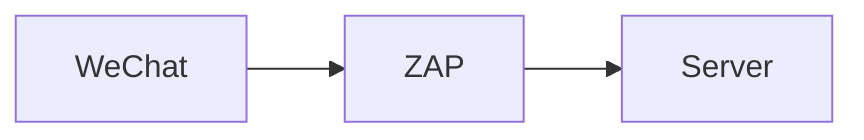

## Introduction

If you are born in China or live there, you must be familiar with WeChat.
WeChat (微信) is a Chinese instant messaging, social media, and mobile payment
app developed by Tencent. But do you ever wonder: what happens when you use
WeChat? What kinds of interactions it has with the server? Why sometimes is it slow to use WeChat as an
overseas Chinese? In this article, we are going to explore these questions, with
a main focus on the networking part. I am going to use my personal account as a
test and see what happens. Note that I am currently living in Paris, France. So
the interactions may be different from yours.

After reading this article, you will understand what are the main websites used
by WeChat, how is a typical route of an HTTP request, the difference in DNS configuration between mainland China and overseas, the ICP license of Tencent, and their proprietary protocol mmTLS. Hopefully, it will allow you to learn a bit more
about network troubleshooting and Tencent Cloud as well. Now, let's get started!

## Environment

The test is made with the following hardware and software:

Item | Comment
:--- | :---
Apple MacBook Pro (13-inch, 2019) | The machine running the test.
WeChat MacOS (3.8.0) | The target application to be tested.
OWASP Zed Attack Proxy (2.12.0) | Mainly used for intercepting HTTP traffic
Wireshark - Network Protocol Analyzer (4.0.6) | Mainly used for intercepting non-HTTP traffic, especially the mmTLS protocol
`traceroute` (1.4a12+Darwin) | Mainly used for tracing the routes between two hosts, the client and the server
`host` (9.10.6) | Mainly used for understand the DNS settings of a given domain name
Ip2Location (<https://www.ip2location.com>) | Mainly used for understanding the information of the server for a given IP address

## Set Up ZAP

To understand what kinds of interactions it has with the server, we need to intercept the traffic. Here, I am using the popular OWASP Zed Attack Proxy (ZAP) to do that. I am doing it by connecting my WeChat application to the ZAP proxy running in localhost on port 8080.

ZAP is what is known as a "man-in-the-middle proxy", which stands between the client and the server so that it can intercept and inspect the messages sent between the client and the server. The relationship can be expressed as follows.



 However, by default, it only intercepts HTTP traffic and does not intercept the HTTPS request because HTTPS is designed to provide secure communication between both sides. When a client establishes an HTTPS connection with a server, it initiates the SSL/TLS handshake directly and establishes an encrypted connection. Therefore, the proxy cannot intercept or modify the traffic. To make it possible to intercept HTTPS traffic, I configured ZAP as a TLS termination proxy by generating a root CA and importing it into the system keychain of MacOS. Then, I configured the proxies at the system level so that all traffic will be intercepted by ZAP, including WeChat.

 

Now if I perform some actions in WeChat, such as refreshing the moments (朋友圈), visiting articles in the Official Accounts (公众号), or searching some keywords in the search bar (搜一搜), etc. I can see many requests being intercepted:


You can guess the purpose of some of those domains: the ones having the keyword "mp" probably mean WeChat Mini Program (小程序), and those having the keyword "channels" probably mean WeChat Channels (视频号). Also, I think `qpic` means "QQ Picture" and `qlogo` means "QQ Logo", which stores the pictures and logos as part of the Tencent Group (formerly QQ). There are many others to explore, but since it's not the purpose of the article to understand all the domains, I am going to just stop here.

## Traceroute

Now we know the global landscape of all the domains. Let's focus on one HTTP request, and see how it reaches the destination. Currently, I live in Paris, so I want to see how WeChat sends my request to the server, where are the servers, and how complex the networking is. To answer these questions, I am going to use the `traceroute` command. This is a computer network diagnostic command for displaying possible routes (paths) and measuring transit delays of packets across an Intern Protocol (IP) network.

Below is a `traceroute` command that I made to connect to the `vweixinthumb.tc.qq.com` website.

```
➜  ~ traceroute vweixinthumb.tc.qq.com
traceroute: Warning: vweixinthumb.tc.qq.com has multiple addresses; using 101.33.110.25
traceroute to socwxsns.video.qq.com (101.33.110.25), 64 hops max, 52 byte packets
 1  192.168.1.1 (192.168.1.1)  4.393 ms  3.348 ms  4.066 ms
 2  80.10.253.29 (80.10.253.29)  8.648 ms  5.384 ms  4.795 ms
 3  lag-10.nenly00z.rbci.orange.net (80.10.154.194)  8.486 ms  4.518 ms  4.631 ms
 4  ae91-0.ncidf304.rbci.orange.net (193.253.82.102)  5.663 ms  7.221 ms  5.479 ms
 5  ae42-0.niidf302.rbci.orange.net (193.252.159.153)  5.117 ms  6.203 ms  4.632 ms
 6  ae40-0.niidf301.rbci.orange.net (193.252.103.37)  5.207 ms  5.828 ms  5.379 ms
 7  81.253.184.6 (81.253.184.6)  5.208 ms  5.443 ms  5.148 ms
 8  * tatateleglobe-8.gw.opentransit.net (193.251.251.20)  6.442 ms *
 9  * * if-ae-39-2.tcore1.pvu-paris.as6453.net (80.231.246.6)  239.959 ms
10  * * *
11  if-be-7-2.ecore1.emrs2-marseille.as6453.net (195.219.174.8)  329.872 ms  296.726 ms *
12  * * *
13  if-ae-2-2.tcore2.svw-singapore.as6453.net (180.87.12.2)  364.041 ms
	if-be-45-2.ecore2.esin4-singapore.as6453.net (180.87.108.4)  236.217 ms  308.058 ms
14  11.28.188.149 (11.28.188.149)  306.029 ms
	11.28.189.87 (11.28.189.87)  333.742 ms
	11.28.189.85 (11.28.189.85)  377.984 ms
15  * * *
16  * * *
17  * * *
```

Traceroute traces the path an IP packet takes across one or many networks. In my case, it goes through 14 devices/hops before reaching the destination, i.e. `vweixinthumb.tc.qq.com`. The first line provides a warning about the multiple choices of the same domain name, so the traceroute command only picked one of them, which was 101.33.110.25 to perform the test. Then, traceroute found out that the domain name `vweixinthumb.tc.qq.com` is an alias of `socwxsns.video.qq.com` (i.e. a CNAME record in the DNS server). This execution is configured to go through maximum 64 hops, and use packets of 52 bytes.

```
 7  81.253.184.6 (81.253.184.6)  5.208 ms  5.443 ms  5.148 ms
 8  * tatateleglobe-8.gw.opentransit.net (193.251.251.20)  6.442 ms *
```

Now, let's take a closer look at each hop recorded by the `traceroute` command. Each hop contains several pieces of information: the hop number, the domain name, the underlying IP address, and the round-trip time (RTT) of the 3 responses sent back by the hop. Then, the character asterisk (`*`) means that the hop did not respond within the given timeout. It's important to note that some hops may not respond or may have their IP addresses hidden for security reasons. This is why you see asterisks in some of the lines.

As you may see, the speed of the exchange was very fast at the beginning of the traceroute command, I got the response within 10 ms, but starting from the open transit (hop 8), the round-trip time (RTT) increased significantly. But how to explain this phenomenon? To better understand this, I enriched the IP address with more information, retrieved from Ip2Location (<https://www.ip2location.com>), regarding the geographical information, internet service provider (ISP), and the autonomous system number (ASN) and draw the diagram below:


The request went through 3 autonomous systems: AS2278 Orange S.A., AS5511 Orange S.A. and AS6453 Tata Communications (America) Inc. In the field of telecommunications, an autonomous system refers to a network or a collection of connected networks that are operated by a single organization or entity and have a common routing policy. It's commonly known by its abbreviation "AS". Each autonomous system is assigned a unique identification number called an Autonomous System Number (ASN). Our traceroute command went through 3 autonomous systems, two of them owned by Orange S.A. and one owned by Tata Communications (America) Inc. You can see that the route used by the request wasn't really optimal: the request went from Paris to Côte d'Azur, to Bretagne, to Rhone-Alpes and back to Paris again, before going to the AS of Tata Communications. But I guess this is hard to optimize since different autonomous system is operated by different companies.

In hop 13, you can see two results. It indicates that there are multiple network paths or interfaces available at that specific hop, and traceroute is displaying the RTT measurements for each of those paths or interfaces. This can occur to various factors, such as network redundancy, load balancing, or different routing policies. Similar to Hop 14.

From the traceroute command above, we can summarize that:

* It's slow for European countries to use WeChat since the data is not stored in Europe, but in Singapore.
* There are two telecommunication companies involved: Orange and Tata.

## DNS

Now I want to change the direction and study another aspect of the networking problem: the Domain Name System (DNS). For the same URL in the article, do people in mainland China see the same content as people in other places? To answer this question, I picked one subdomain found in ZAP: <https://cmmsns.qpic.cn>, I want to know where are servers hosted based in different geographical zones. Therefore, I picked 3 DNS servers: the CloudFlare DNS server (1.1.1.1), the Orange DNS server in France (80.10.246.2), and the Baidu DNS server in China (180.76.76.76). This is done by changing the network settings in the local machine.

Here is the result using CloudFlare DNS (1.1.1.1):

```
➜ ~ dig cmmsns.qpic.cn

; <<>> DiG 9.10.6 <<>> cmmsns.qpic.cn
;; global options: +cmd
;; Got answer:
;; ->>HEADER<<- opcode: QUERY, status: NOERROR, id: 52419
;; flags: qr rd ra; QUERY: 1, ANSWER: 5, AUTHORITY: 0, ADDITIONAL: 1

;; OPT PSEUDOSECTION:
; EDNS: version: 0, flags:; udp: 1232
;; QUESTION SECTION:
;cmmsns.qpic.cn.			IN	A

;; ANSWER SECTION:
cmmsns.qpic.cn.		60	IN	CNAME	mmsns.qpic.wechatos.net.
mmsns.qpic.wechatos.net. 300	IN	A	43.130.30.140
mmsns.qpic.wechatos.net. 300	IN	A	43.130.30.221
mmsns.qpic.wechatos.net. 300	IN	A	43.130.30.120
mmsns.qpic.wechatos.net. 300	IN	A	43.130.30.12

;; Query time: 493 msec
;; SERVER: 1.1.1.1#53(1.1.1.1)
;; WHEN: Sun Jun 04 18:19:43 CEST 2023
;; MSG SIZE  rcvd: 144
```

In this case, the sub-domain `cmmsns.qpic.cn` is a CNAME record, an alias, pointing to `mmsns.qpic.wechatos.net`, which is hosted in the United States. It means that when we open an article or any resource in WeChat, some pictures are probably loaded from the United States. This can be slow or fast depending on where do you live.

Now, I switched to Orange DNS in France (80.10.246.2):

```
➜ ~ dig cmmsns.qpic.cn

; <<>> DiG 9.10.6 <<>> cmmsns.qpic.cn
;; global options: +cmd
;; Got answer:
;; ->>HEADER<<- opcode: QUERY, status: NOERROR, id: 5407
;; flags: qr rd ra; QUERY: 1, ANSWER: 5, AUTHORITY: 0, ADDITIONAL: 1

;; OPT PSEUDOSECTION:
; EDNS: version: 0, flags:; udp: 1232
;; QUESTION SECTION:
;cmmsns.qpic.cn.			IN	A

;; ANSWER SECTION:
cmmsns.qpic.cn.		46	IN	CNAME	mmsns.qpic.wechatos.net.
mmsns.qpic.wechatos.net. 25	IN	A	43.130.30.120
mmsns.qpic.wechatos.net. 25	IN	A	43.130.30.12
mmsns.qpic.wechatos.net. 25	IN	A	43.130.30.140
mmsns.qpic.wechatos.net. 25	IN	A	43.130.30.221

;; Query time: 14 msec
;; SERVER: 80.10.246.2#53(80.10.246.2)
;; WHEN: Sun Jun 04 18:37:09 CEST 2023
;; MSG SIZE  rcvd: 144
```

The data are stored in the same place, it's still pointed to `mmsns.qpic.wechatos.net` which is hosted in the United States.

Now, let's use Baidu DNS server (180.76.76.76):

```
➜ ~ dig cmmsns.qpic.cn

; <<>> DiG 9.10.6 <<>> cmmsns.qpic.cn
;; global options: +cmd
;; Got answer:
;; ->>HEADER<<- opcode: QUERY, status: NOERROR, id: 64007
;; flags: qr rd ra; QUERY: 1, ANSWER: 16, AUTHORITY: 0, ADDITIONAL: 0

;; QUESTION SECTION:
;cmmsns.qpic.cn.			IN	A

;; ANSWER SECTION:
cmmsns.qpic.cn.		190	IN	A	36.248.45.104
cmmsns.qpic.cn.		190	IN	A	36.248.45.105
cmmsns.qpic.cn.		190	IN	A	36.248.45.106
...

;; Query time: 371 msec
;; SERVER: 180.76.76.76#53(180.76.76.76)
;; WHEN: Sun Jun 04 18:21:57 CEST 2023
;; MSG SIZE  rcvd: 288
```

This time, I got a completely different answer: the domain name is not a CNAME record anymore. It's an A record that directly points to the servers hosted in mainland China. For example, the first IP address in the result, the server 36.248.45.104, is hosted in Fuzhou, Fujian, China, under AS4837, operated by China Unicom, according to Ip2Location (<https://www.ip2location.com/36.248.45.104>).

What does it actually mean? It means that from the web hosting point of view, Chinese regions and international regions are serving the content using different servers, respectively hosted in mainland China and the United States. Tencent Cloud provides multiple solutions for data replication that may fit such a scenario, there are [Cross-Region Replication (CRR)](https://www.tencentcloud.com/document/product/436/35272?lang=en) at the Cloud Object Storage (COS) level, [Data Transmission Service (DTS)](https://www.tencentcloud.com/products/dts) at the database level, and maybe more.

## ICP License

Any internet content provider (ICP) providing online services in China needs to have an ICP license (ICP备案). This is a permit issued by the Chinese Ministry of Industry and Information Technology (MIIT). The ICP license numbers for Chinese websites can often be found on the bottom of the front webpage.

According to [Alibaba Cloud](https://www.alibabacloud.com/help/en/icp-filing/latest/prepare-and-check-the-domain-name), you cannot apply for an ICP filing for a domain name whose top-level domain name is not approved by the MIIT. To check whether your domain name is qualified for an ICP filing application. Here is the graph provided by the MIIT (中华人民共和国工业和信息化部). You can see that `.cn` is a country top-level domain name:


Now, let's check the ICP license of one of the websites used by WeChat: `qpic.cn`. If you go to the website of MIIT, you can find this information by querying the domain name. So for `qpic.cn`, its license is 粤B2-20090059, granted by the Guangdong region. Note that 1) the regulations are slightly different for each region, Alibaba Cloud has [detailed instructions for each region](https://www.alibabacloud.com/help/en/icp-filing/latest/read-and-understand-the-icp-regulations) on its website; 2) the content of the MIIT website is only in Chinese; 3) the URL of the result is not sharable since it does not contain the query you entered in the search bar.


## mmTLS

In the section above, I inspected some traffic based on HTTP/S. However, I realized very quickly that most of the traffic didn't go through HTTP/S. For example, when a friend sends a message to me in the chat, when I refresh the "moments (朋友圈)", etc. This confused me a lot. After reading some research papers, I found out that Tencent does not rely on HTTP/S for communication: they use a proprietary encryption protocol called mmTLS for most of its communications. It is designed based on Transport Layer Security (TLS) 1.3 drafts for both performance and security.

ZAP can only intercept HTTP-based traffic, therefore, it cannot intercept mmTLS traffic. To intercept mmTLS, I used [Wireshark](https://www.wireshark.org/). But since the data is encrypted and I don't know where is the key for the decryption, I couldn't read the content of the request or response. According to Ip2Location, the server (<https://www.ip2location.com/162.62.115.23>) that interacts with me is a server hosted in Frankfurt am Main, Hessen, Germany, in Tencent's datacenter.


If you want to learn more about mmtls, I recommend you to read this article on GitHub: [基于TLS1.3的微信安全通信协议mmtls介绍.md](https://github.com/WeMobileDev/article/blob/master/%E5%9F%BA%E4%BA%8ETLS1.3%E7%9A%84%E5%BE%AE%E4%BF%A1%E5%AE%89%E5%85%A8%E9%80%9A%E4%BF%A1%E5%8D%8F%E8%AE%AEmmtls%E4%BB%8B%E7%BB%8D.md) (introduction to mmtls, the WeChat secure communication protocol based on TLS 1.3).

## Conclusion

In this article, we intercepted the traffic of WeChat (MacOS) using two tools: Zed Attack Proxy (ZAP) and Wireshark. We saw the route between my computer in France and the server in Singapore, the different DNS settings for the domain `cmmsns.qpic.cn` in mainland China and overseas, the information of the ICP license of `qpic.cn` and finally some basic information related to mmtls. Interested to know more? You can subscribe to [the feed of my blog](/feed.xml), follow me
on [Twitter](https://twitter.com/mincong_h) or
[GitHub](https://github.com/mincong-h/). Hope you enjoy this article, see you the next time!

## References

- [How to Use Traceroute to Identify Network Problems](https://www.howtogeek.com/134132/how-to-use-traceroute-to-identify-network-problems/)
- [Network: Underestanding the traceroute output](https://www.lumen.com/help/en-us/network/traceroute/understanding-the-traceroute-output.html)
- [Les adresses DNS des fournisseurs d'accès Internet](https://www.ariase.com/box/dossiers/adresses-dns)
- [What is Traceroute? How It Works and How to Read Results](https://www.varonis.com/blog/what-is-traceroute)
- [Autonomous system (Internet)](https://en.wikipedia.org/wiki/Autonomous_system_%28Internet%29)
- [Ip2Location: Identify Geographical Location and Proxy by IP Address](https://www.ip2location.com/)
- [Prepare and check the domain name - Alibaba Cloud](https://www.alibabacloud.com/help/en/icp-filing/latest/prepare-and-check-the-domain-name)