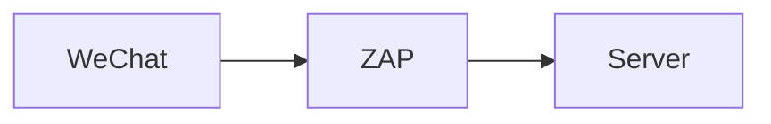

## Introduction

If you are born in China or live there, you must be familiar with WeChat.
WeChat (微信) is a Chinese instant messaging, social media, and mobile payment
app developed by Tencent. But do you ever wonder: what happens when you use
WeChat? What kinds of interactions it has with the server? What are the
information stored in your device? Why sometime is it slow to use WeChat as an
overseas Chinese? In this article, we are going to explore these questions, with
a main focus on the networking part. I am going to use my personal account as a
test, and see what happens. Note that I am currently living in Paris, France. So
the interactions may be different from yours.

After reading this article, you will understand what are the main websites used
by WeChat, how is a typical route of an HTTP request, how does WeChat store the
information in MacOS, etc. Hopefully, it will allow you to learn a bit more
about network troubleshooting and Tencent Cloud as well. Now, let's get started!

## Environment

The test is made with the following hardware and software:

Item | Comment
:--- | :---
Apple MacBook Pro (13-inch, 2019) | The machine running the test.
WeChat MacOS (3.8.0) | The target application to be tested.
OWASP Zed Attack Proxy (2.12.0) | Mainly used for intercepting HTTP traffic
Wireshark - Network Protocol Analyzer (4.0.6) | Mainly used for intercepting non-HTTP traffic, especially the mmTLS protocol
`traceroute` (1.4a12+Darwin) | Mainly used for tracing the routes between two hosts, the client and the server
`host` (9.10.6) | Mainly used for understand the DNS settings of a given domain name
Ip2Location (<https://www.ip2location.com>) | Mainly used for understand the information of the server for a given IP address

## Set Up ZAP

To understand what kinds of interactions it has with the server, we need to intercept the traffic. Here, I am using the popular OWASP Zed Attack Proxy (ZAP) to do that. I am doing it by connecting my WeChat application to the ZAP proxy running in localhost on port 8080.

ZAP is what is known as a "man-in-the-middle proxy", which stands between the client and the server so that it can intercept and inspect the messages sent between the client and the server. The relationship can be expressed as follows.



 However, by default, it only intercepts HTTP traffic and does not intercept the HTTPS request because HTTPS is designed to provide secure communication between both sides. When a client establises an HTTPS connection with a server, it initiates the SSL/TLS handshake directly and establish an encrypted connection. Therefore, the proxy cannot intercept or modify the traffic. To make it possible to intercept HTTPS traffic, I configured ZAP as a TLS termination proxy by generating a root CA and importing it into the system keychain of MacOS. Then, I configured the proxies at system level so that all traffic will be intercepted by ZAP, including WeChat.

 

Now if I perform some actions in WeChat, such as refreshing the moments (朋友圈), visiting articles in the Official Accounts (公众号), or searching some keywords in the search bar (搜一搜), etc. I can see many requests being intercepted:


You can guess the purpose of some of those domains: the ones having the keyword "mp" probably means WeChat Mini Program (小程序), those having the keyword "channels" probably means WeChat Channels (视频号). Also, I think `qpic` means "QQ Picture" and `qlogo` means "QQ Logo", which stores the pictures and logos as part of the Tencent Group (formerly QQ). There are many others to explore, but since it's not the purpose of the article to understand all the domains, I am going to just stop here.

## Traceroute

Now we know the global landscape of all the domains. Let's focus on one HTTP request, and see how it reaches to the destination. Currently, I live in Paris, so I want to see how WeChat sends my request to the server, where are the servers, how complex the networking is. To answer these questions, I am going to use the `traceroute` command. This is a computer network diagnostic command for displaying posible routes (paths) and measure transit delays of packets across an Intern Protocol (IP) network.

Below is a `traceroute` command that I made to connect to the `vweixinthumb.tc.qq.com` website.

```
➜  ~ traceroute vweixinthumb.tc.qq.com
traceroute: Warning: vweixinthumb.tc.qq.com has multiple addresses; using 101.33.110.25
traceroute to socwxsns.video.qq.com (101.33.110.25), 64 hops max, 52 byte packets
 1  192.168.1.1 (192.168.1.1)  4.393 ms  3.348 ms  4.066 ms
 2  80.10.253.29 (80.10.253.29)  8.648 ms  5.384 ms  4.795 ms
 3  lag-10.nenly00z.rbci.orange.net (80.10.154.194)  8.486 ms  4.518 ms  4.631 ms
 4  ae91-0.ncidf304.rbci.orange.net (193.253.82.102)  5.663 ms  7.221 ms  5.479 ms
 5  ae42-0.niidf302.rbci.orange.net (193.252.159.153)  5.117 ms  6.203 ms  4.632 ms
 6  ae40-0.niidf301.rbci.orange.net (193.252.103.37)  5.207 ms  5.828 ms  5.379 ms
 7  81.253.184.6 (81.253.184.6)  5.208 ms  5.443 ms  5.148 ms
 8  * tatateleglobe-8.gw.opentransit.net (193.251.251.20)  6.442 ms *
 9  * * if-ae-39-2.tcore1.pvu-paris.as6453.net (80.231.246.6)  239.959 ms
10  * * *
11  if-be-7-2.ecore1.emrs2-marseille.as6453.net (195.219.174.8)  329.872 ms  296.726 ms *
12  * * *
13  if-ae-2-2.tcore2.svw-singapore.as6453.net (180.87.12.2)  364.041 ms
	if-be-45-2.ecore2.esin4-singapore.as6453.net (180.87.108.4)  236.217 ms  308.058 ms
14  11.28.188.149 (11.28.188.149)  306.029 ms
	11.28.189.87 (11.28.189.87)  333.742 ms
	11.28.189.85 (11.28.189.85)  377.984 ms
15  * * *
16  * * *
17  * * *
```

Traceroute traces the path an IP packet takes across one or many networks. In my case, it goes throught 14 devices/hops before reaching the destination, i.e. `vweixinthumb.tc.qq.com`. The first line provides a warning about the multiple choices of the same domain name, so the traceroute command only picked one of them, which was 101.33.110.25 to perform the test. Then, traceroute found out that the domain name `vweixinthumb.tc.qq.com` is actually an alias of `socwxsns.video.qq.com` (i.e. a CNAME record in the DNS server). This execution is configured to go through maximum 64 hops, and using packets of 52 bytes.

```
 7  81.253.184.6 (81.253.184.6)  5.208 ms  5.443 ms  5.148 ms
 8  * tatateleglobe-8.gw.opentransit.net (193.251.251.20)  6.442 ms *
```

Now, let's take a closer look into each hop recorded by the `traceroute` command. Each hop contains several information: the hop number, the domain name, the underlying IP address, and the round-trip time (RTT) of the 3 responses sent back by the hop. Then, the character asterisk (`*`) means that the hop did not respond within the given timeout. It's important to note that some hops may not respond or may have their IP addresses hidden for security reasons. This is why you see asterisks in some of the lines.

As you may see, the speed of the exchange was very fast at the beginning of the traceroute command, I got the response within 10 ms, but starting from the open transit (hop 8), the round-trip time (RTT) increased significantly. But how to explain this phenomenon? To better understand this, I enriched the IP address with more information, retrieved from Ip2Location (<https://www.ip2location.com>), regarding the geographical information, internet service provider (ISP), and the autonomous system number (ASN) and draw the digram below:


The request went through 3 autonomous systems: AS2278 Orange S.A., AS5511 Orange S.A. and AS6453 Tata Communications (America) Inc. In the field of telecommunications, an autonomous system refers to a network or a collection of connected networks that are operated by a single organization or entity and have a common routing policy. It's commonly know by its abbreviation "AS". Each autonomous system is assigned a unique identification number called an Autonomous System Number (ASN). Our traceroute command went 3 autonomous systems, two of them owned by Orange S.A. and one owned by Tata Communications (America) Inc. You can see that the route used by the request wasn't really optimal: the request went from Paris to Côte d'Azur, to Bretagne, to Rhone-Alpes and back to Paris again, before going to the AS of Tata communications. But I guess this is hard to optimized since different autonomous system is operated by different companies.

In hop 13, you can see two results. It indicates that there are multiple network paths or interfaces available at that specific hop, and traceroute is displaying the RTT measurements for each of those paths or interfaces. This can occur to various factors, such as network redundancy, load balancing, or different routing policies. Similar for hop 14.

From the traceroute command above, we can summarize that:

* It's slow for european countries to use WeChat, since the data is not stored in Europe, but in Singapore.
* There are two telecommunication companies involved: Orange and Tata.

## Going Further

How to go further from here?

## Conclusion

What did we talk in this article? Take notes from introduction again.
Interested to know more? You can subscribe to [the feed of my blog](/feed.xml), follow me
on [Twitter](https://twitter.com/mincong_h) or
[GitHub](https://github.com/mincong-h/). Hope you enjoy this article, see you the next time!

## References
