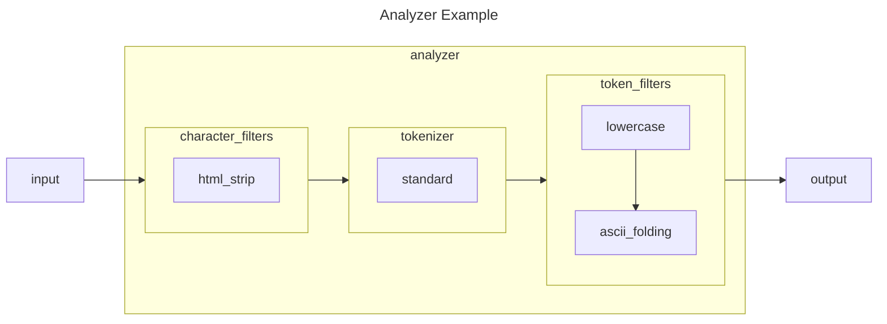

## Introduction

We are going to talk about text processing in Elasticsearch, more specifically, how to test Analyzers in Elasticsearch. Analyzer is a powerful concept, it is useful for processing your content and your queries. However, an analyzer is complex. It contains several kinds of components, including character filters, tokenizers, and token filters. The official documentation of Elastic provides a lot of information about each component. However, it is really difficult to understand the exact behaviors of each analyzer and how your data are processed. Also, the official documentation only explains the technical aspects of each component, but you need to translate and apply them for your application. That is, finding other ways to evaluate whether the current setup meets the business requirements. This can be specific to your industry, the language of the content, the geographic zone, etc. In this article, we are going to use the Analyze API to evaluate the data ingestion end-to-end, where you can provide the content and see the output generated by Elasticsearch.

## Analyzer Overview



Here is an example showing the components inside an analyzer.

* [Character filters](https://www.elastic.co/guide/en/elasticsearch/reference/current/analysis-charfilters.html) are used to preprocess the stream of characters before it is passed to the tokenizer. A character filter receives the original text as a stream of characters, and can transform the stream by adding, removing or changing characters. For example, the HTML Strip Character Filter strips out HTML elements like `<b>` and the code html entity like `&amp;`.
* [A tokenizer](https://www.elastic.co/guide/en/elasticsearch/reference/current/analysis-tokenizers.html) receives a stream of characters, breaks it up into individual tokens (usually individual words), and outputs a stream of tokens. For example, the white space tokenizer breaks text into tokens whenever it sees any whitespace.
* [Token filters](https://www.elastic.co/guide/en/elasticsearch/reference/current/analysis-tokenfilters.html) accept a stream of tokens from a tokenizer and can modify tokens (e.g. lowercasing), delete tokens (e.g. remove stopwords), or add tokens (eg synonyms). 

Once you have the analyzer, you can use it at different levels. You can use it at a filed level, at the index level, at the percolator level for queries, at the ingestion-pipelines level, at the search-time, etc. Here is an example where we use the analyzer at the field level. Under the mappings of your property  (your field), you specify the analyzer used for analyzing the data.

```js
{
  "settings": {
    // ...
    "mappings": {
      "properties": {
        "content": {
          "type": "text",
          "analyzer": "lowercase_ascii_folding_analyzer",
        }
        // ...
      }
    }
  }
}
```

## Section 2

## Section 3

## Going Further

How to go further from here?

## Conclusion

What did we talk in this article? Take notes from introduction again.
Interested to know more? You can subscribe to [the feed of my blog](/feed.xml), follow me
on [Twitter](https://twitter.com/mincong_h) or
[GitHub](https://github.com/mincong-h/). Hope you enjoy this article, see you the next time!

## References
