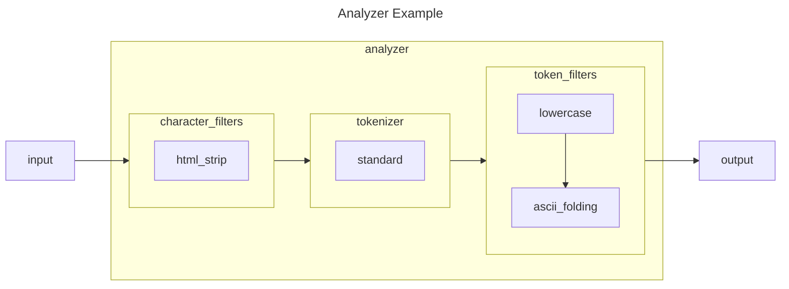

## Introduction

We are going to talk about text processing in Elasticsearch, more specifically, how to test Analyzers in Elasticsearch. Analyzer is a powerful concept, it is useful for processing your content and your queries. However, an analyzer is complex. It contains several kinds of components, including character filters, tokenizers, and token filters. The official documentation of Elastic provides a lot of information about each component. However, it is really difficult to understand the exact behaviors of each analyzer and how your data are processed. Also, the official documentation only explains the technical aspects of each component, but you need to translate and apply them for your application. That is, finding other ways to evaluate whether the current setup meets the business requirements. This can be specific to your industry, the language of the content, the geographic zone, etc. In this article, we are going to use the Analyze API to evaluate the data ingestion end-to-end, where you can provide the content and see the output generated by Elasticsearch.

## Analyzer Overview



Here is an example showing the components inside an analyzer.

* [Character filters](https://www.elastic.co/guide/en/elasticsearch/reference/current/analysis-charfilters.html) are used to preprocess the stream of characters before it is passed to the tokenizer. A character filter receives the original text as a stream of characters, and can transform the stream by adding, removing or changing characters. For example, the HTML Strip Character Filter strips out HTML elements like `<b>` and the code html entity like `&amp;`.
* [A tokenizer](https://www.elastic.co/guide/en/elasticsearch/reference/current/analysis-tokenizers.html) receives a stream of characters, breaks it up into individual tokens (usually individual words), and outputs a stream of tokens. For example, the white space tokenizer breaks text into tokens whenever it sees any whitespace.
* [Token filters](https://www.elastic.co/guide/en/elasticsearch/reference/current/analysis-tokenfilters.html) accept a stream of tokens from a tokenizer and can modify tokens (e.g. lowercasing), delete tokens (e.g. remove stopwords), or add tokens (eg synonyms). 

Once you have the analyzer, you can use it at different levels. You can use it at a filed level, at the index level, at the percolator level for queries, at the ingestion-pipelines level, at the search-query level, etc. Here is an example where we use the analyzer at the field level. Under the mappings of your property  (your field), you specify the analyzer used for analyzing the data.

```js
{
  "settings": {
    // ...
    "mappings": {
      "properties": {
        "content": {
          "type": "text",
          "analyzer": "lowercase_ascii_folding_analyzer",
        }
        // ...
      }
    }
  }
}
```

## Analyze API

The [Analyze API](https://www.elastic.co/guide/en/elasticsearch/reference/current/indices-analyze.html) is an API for viewing the terms produced by an analyzer. You can choose an analyzer and an input text to evaluate the tokens produced by the analyzer. Recently, I was working on supporting French and Chinese for the [ChatGPT QuickSearch Extension](https://chromewebstore.google.com/detail/chatgpt-quicksearch/jclniokkhcjpgfijopjahldoepdikcko). Here are some examples of that product.

You can use Analyze API by specifying explicitly the analyzer. Here I choose the lowercase ASCII folding analyzer. I want to use the French sentence "À bientôt !" for the test.

```sh
GET /my_index/_analyze

{
  "analyzer": "lowercase_ascii_folding_analyzer",
  "text": "À bientôt !"
}
```

From the results below, you can see that the accent is removed from the character 'à' and 'ô'. The analyzer produced two additional tokens and the original words are preserved.

```json
{
  "tokens": [
    {
      "token": "a",
      "start_offset": 0,
      "end_offset": 1,
      "type": "<ALPHANUM>",
      "position": 0
    },
    {
      "token": "à",
      "start_offset": 0,
      "end_offset": 1,
      "type": "<ALPHANUM>",
      "position": 0
    },
    {
      "token": "bientot",
      "start_offset": 2,
      "end_offset": 9,
      "type": "<ALPHANUM>",
      "position": 1
    },
    {
      "token": "bientôt",
      "start_offset": 2,
      "end_offset": 9,
      "type": "<ALPHANUM>",
      "position": 1
    }
  ]
}
```

But sometimes you don't want to limit your evaluation to the analyzer, but you want to target a field. Because the field is closer to the application level than the analyzer. So when targeting the field, then your validation will still be valid even if the analyzer is changed.

```sh
GET /my_index/_analyze

{
  "field": "content",
  "text": "À bientôt !"
}
```

If you work with Chinese content, you can also evaluate the Chinese content. This is completely different from English or French. The tokenizer needs to understand and tokenize ideography. One possible solution is to use the [International Components for Unicode (ICU)](https://icu.unicode.org/) plugin. Here are the tokens produced for 中华人民共和国国歌 (National Anthem of the People's Republic of China).

```sh
GET /my_chinese_index/_analyze

{
  "field": "content",
  "text": "中华人民共和国国歌"
}
```

```json
{
  "tokens": [
    {
      "token": "中华",
      "start_offset": 0,
      "end_offset": 2,
      "type": "<IDEOGRAPHIC>",
      "position": 0
    },
    {
      "token": "人民",
      "start_offset": 2,
      "end_offset": 4,
      "type": "<IDEOGRAPHIC>",
      "position": 1
    },
    {
      "token": "共和国",
      "start_offset": 4,
      "end_offset": 7,
      "type": "<IDEOGRAPHIC>",
      "position": 2
    },
    {
      "token": "国歌",
      "start_offset": 7,
      "end_offset": 9,
      "type": "<IDEOGRAPHIC>",
      "position": 3
    }
  ]
}
```


## Other Considerations

When working with the analyzer you need to consider the impact of the changes for your existing documents. Especially when you have a lot of documents. Any changes can impact the data ingestion, the data storage, or the data retrieval process. Therefore, it is important to evaluate the impact using the Analyze API and write non-regression tests to ensure the quality of your application. Then, at the document level, you can also use the Explain API to understand whether a document matches a specific query. This is not directly related to the analyzer, but if you change your analyzer, then it may change the terms produced by the system, which impacts the queries.

## Conclusion

In this article, we went through the overview of the analyzer. Then, we saw how to use the Analyze API to evaluate specific content on an analyzer.
Interested to know more? You can subscribe to [the feed of my blog](/feed.xml), follow me
on [Twitter](https://twitter.com/mincong_h) or
[GitHub](https://github.com/mincong-h/). Hope you enjoy this article, see you the next time!

## References

* Elasticsearch: analyzer by Elastic 中国社区官方博客, https://blog.csdn.net/UbuntuTouch/article/details/100392478
* Analyze API by Elasticsearch Documentation, https://www.elastic.co/guide/en/elasticsearch/reference/current/indices-analyze.html