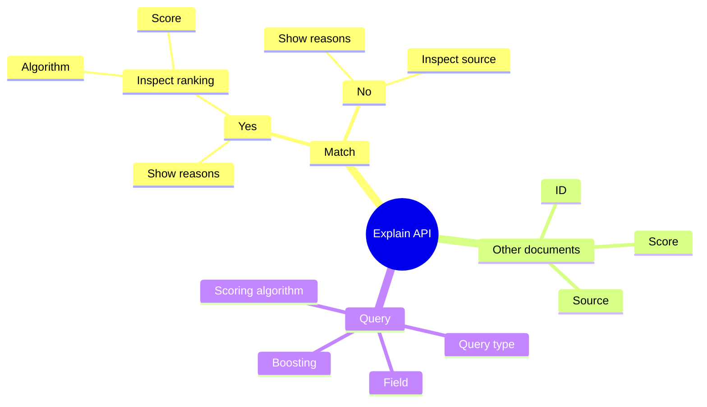


The target audience of this document is prospects who are interested in hiring me as a freelancer for consulting service. They run Elasticsearch as a cluster and want to better understand their documents or queries. They have difficulties to troubleshoot the queries. They don't understand why the search results don't match their expectation, and they don't know how to improve.


## Introduction

Elasticsearch is a complex search engine. It has a lot of capabilities under the hook. When you enter a query, you may find the results irrelevant to your query. It seems obvious that some documents should be part of the result, or they should be ranked higher in the list. However, you may be frustrated about the ranking, or even worse, you don't see what you want in the list. In this article, we are going discuss the [Explain API](https://www.elastic.co/guide/en/elasticsearch/reference/current/search-explain.html) of Elasticsearch and see how it can help you troubleshoot the read path of your system.

Actually, Elasticsearch is not the only database that provides an Explain API. This kind of API exists in many databases, such as [MySQL](https://dev.mysql.com/doc/refman/8.0/en/explain.html), [PostgreSQL](https://www.postgresql.org/docs/current/sql-explain.html), [Microsoft SQL Server](https://learn.microsoft.com/en-us/sql/t-sql/queries/explain-transact-sql?view=azure-sqldw-latest), [MongoDB](https://www.mongodb.com/docs/manual/reference/command/explain/), and more.




After reading this article, you will understand:

* How to use the Explain API?
* The scoring algorithm BM25
* Other considerations around troubleshooting

Now, let's get started!

## Definition

They explain API returns information about why a specific document matches or does not match a query. The input of the API consists of the name of the index, the ID of the document and the search query. Here is an example from the official documentation, where the name of the index is "my-index-000001" and the id of the document is "0". The query is a simple match query on the field "message" with the value "elasticsearch".

```
GET /my-index-000001/_explain/0
```

```json
{
  "query" : {
    "match" : { "message" : "elasticsearch" }
  }
}
```

As for the response, it explains whether the document matches and provides the associated explanation and metadata of the document. The response used the BM25 algorithm to compute the score of the document for this query. It consists of the boosting coefficient, the inverse document frequency (IDF) and the term frequency (TF). In this example, the boosting is 1.69, IDF is 1.38 and the TF is 0.55.

```js
{
   "_index":"my-index-000001",
   "_id":"0",
   "matched":true,
   "explanation":{
      "value":1.6943598,
      "description":"weight(message:elasticsearch in 0) [PerFieldSimilarity], result of:",
      "details":[
         {
            "value":1.6943598,
            "description":"score(freq=1.0), computed as boost * idf * tf from:",
            "details":[
               {
                  "value":2.2,
                  "description":"boost",
                  "details":[]
               },
               {
                  "value":1.3862944,
                  "description":"idf, computed as log(1 + (N - n + 0.5) / (n + 0.5)) from:",
                  "details":[
                     {
                        "value":1,
                        "description":"n, number of documents containing term",
                        "details":[]
                     },
                     {
                        "value":5,
                        "description":"N, total number of documents with field",
                        "details":[]
                     }
                  ]
               },
               {
                  "value":0.5555556,
                  "description":"tf, computed as freq / (freq + k1 * (1 - b + b * dl / avgdl)) from:",
                  "details":[
                     {
                        "value":1.0,
                        "description":"freq, occurrences of term within document",
                        "details":[]
                     },
                     {
                        "value":1.2,
                        "description":"k1, term saturation parameter",
                        "details":[]
                     },
                     {
                        "value":0.75,
                        "description":"b, length normalization parameter",
                        "details":[]
                     },
                     {
                        "value":3.0,
                        "description":"dl, length of field",
                        "details":[]
                     },
                     {
                        "value":5.4,
                        "description":"avgdl, average length of field",
                        "details":[]
                     }
                  ]
               }
            ]
         }
      ]
   }
}
```

BM25 is the default similarity algorithm, used by Elasticsearch since 5.0. VM stands for best match and 25 means that the result is obtained after 25 iterations.

## Section 2

## Section 3

## Going Further

How to go further from here?

## Conclusion

What did we talk in this article? Take notes from introduction again.
Interested to know more? You can subscribe to [the feed of my blog](/feed.xml), follow me
on [Twitter](https://twitter.com/mincong_h) or
[GitHub](https://github.com/mincong-h/). Hope you enjoy this article, see you the next time!

## References

- "Practical BM25 - Part 2: The BM25 Algorithm and its Variables", Shane Connelly, 2018. <https://www.elastic.co/blog/practical-bm25-part-2-the-bm25-algorithm-and-its-variables>
- 10.3.3 计算相关度评分，一本书讲透Elasticsearch，杨昌玉