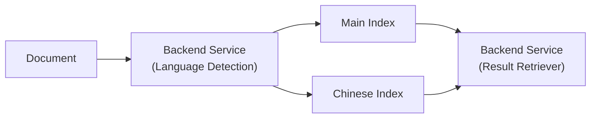


The target audience of this article is people who has an interest in Chinese content. They can be prospects who want to hire me as a consultant for Chinese related content, probably business owners for e-commerce; or Software Engineers specializing in Elasticsearch who want to know more about Chinese support. 


## Introduction

When working with the ChatGPT QuickSearch Extension, I had the opportunity to work on supporting Chinese content in Elasticsearch. Today, I'm going to share my experience of the of this topic, including the motivation of supporting Chinese, the techinical problems and the potential solution using the International Components of Unicode (ICU).

After reading this article, you will understand:

* The motivation of handling Chinese content
* The technical problems around Chinese content
* The architecture chosen by ChatGPT QuickSearch Extension for the implementation

Now, let's get started!

## Motivation

Chinese content is different from other western languages like English or French in many aspects. A Chinese sentence does not contain by any whitespace: all the characters are combined together. Chinese characters are logographs. They don't have the notion of uppercase or lowercase for a given logographs: all the logographs are unicase. The ponctuation is also different: the standard comma (English comma) `,` has the unicode `U+002C` while the Chinese comma (Chinese comma) `，` has the unicode `U+FF0C`. These kinds of differences makes it difficult to handle Chinese content in the search engine, especially when your team does not have a Chinese native speaker.

Supporting Chinese may be important for you. When you are running an e-commerce website for the Chinese marketplace, you have to support Chinese. When you are targeting Chinese native speaker, you have to support Chinese. Implementing the solution properly allows you to attract more customer to your website and provide a better experience for them.

## Problems

Supporting Chinese is challenging because of the differences mentioned in the previous paragraph. If we focus on Elasticsearch, you will realize that you need to handle multiple things: you need to tokenize the text differently because it cannot be split by spaces; you need to analyze your query differently because of the same reason; you need to distinguish the language of the content before indexing it in the search engine; etc.

## Architecture

In the ChatGPT QuickSearch extension, we have chosen an architecture to separate the indices for Chinese content. By doing so, we are able to handle the Chinese content separated from other content. Therefore, we can use analyzer, tokenizer, and other kinds of configuration separately for each index. Then on the read path, we query both indices together to combine the result if any keyword is found. For any document that are mixed of Chinese and English content, it will go to Chinese index because the ICU plug-in is able to analyze any unicode, not only for Chinese. 



In the following paragraph, we are going to dive into each part of the diagram to see its role and the actual implementation.

## Language Detection

For any given content, we iterate over the code point in a string and try to find the unicode script of that code point. If the unicode script happens to be han (汉), then it is considered as Chinese. By doing so, we can show the routing of the document to either the English index or the Chinese index.

## Elasticsearch Mappings

On this storage side, this is the place where the key logic happens. For the main index, we are going to use the standard tokenizer configured by default. For French and other western languages, we use the ASCII folding filter to convert alphabetic, numeric, and symbolic characeters that are not in the Basic Latin Unicode block (first 127 ASCII characters) to the their ASCII equivalent, if one exists. For example, the filter changes `à` to `a`. We also use a lower-case filter to change the words from upper-case to lower-case. For the Chinese index, we use the ICU tokenizer and the ICU analyzer provided by the `analysis-icu` plugin. You can find the source code of the plugin [here on GitHub](https://github.com/elastic/elasticsearch/tree/main/plugins/analysis-icu). It brings a much better support for some Asian languages. Different from the standard tokenizer, it does not simply tokenize the text base on white spaces. It tokenizes text into words on word boundaries, as defined in [UAX #29: Unicode Text Segmentation](https://www.unicode.org/reports/tr29/).

As for the installation, if you are using Elastic Cloud, the plug-in is not installed by default, but you can enable it under the option "manage user settings and extensions" and include the analysis-icu plugin as simple as checking the box. Restarting the cluster is required. If you are using Elasticsearch yourself, you can use the CLI to install it:

```
docker exec elasticsearch bin/elasticsearch-plugin install analysis-icu
```

To test whether the analyzer works as expected, we are going to use the Elasticsearch Analyzer API to send test data and evaluate the result. Here is an example using the mark 巴黎春天 (Printemps):

```json
curl -s localhost:9200/cs.conv-metadata.icu/_analyze/ -H "Content-Type: application/json" -d '{
  "analyzer": "icu_with_edge_ngram",
  "text": "巴黎春天"
}
' | jq
{
  "tokens": [
    {
      "token": "巴",
      "start_offset": 0,
      "end_offset": 2,
      "type": "",
      "position": 0
    },
    {
      "token": "巴黎",
      "start_offset": 0,
      "end_offset": 2,
      "type": "",
      "position": 0
    },
    {
      "token": "春",
      "start_offset": 2,
      "end_offset": 4,
      "type": "",
      "position": 1
    },
    {
      "token": "春天",
      "start_offset": 2,
      "end_offset": 4,
      "type": "",
      "position": 1
    }
  ]
}
```

## Going Further

How to go further from here?

## Conclusion

What did we talk in this article? Take notes from introduction again.
Interested to know more? You can subscribe to [the feed of my blog](/feed.xml), follow me
on [Twitter](https://twitter.com/mincong_h) or
[GitHub](https://github.com/mincong-h/). Hope you enjoy this article, see you the next time!

## References

- https://www.elastic.co/guide/en/elasticsearch/plugins/current/analysis-icu-tokenizer.html