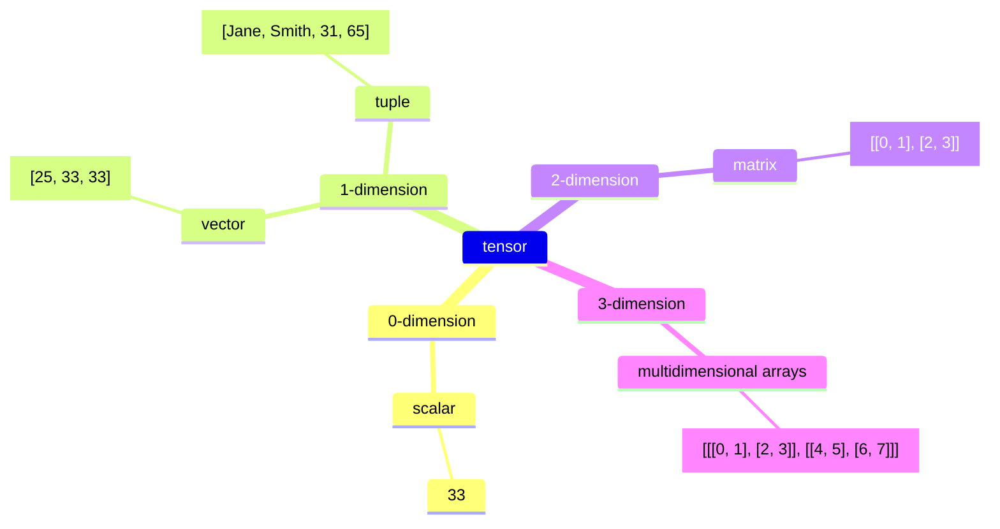
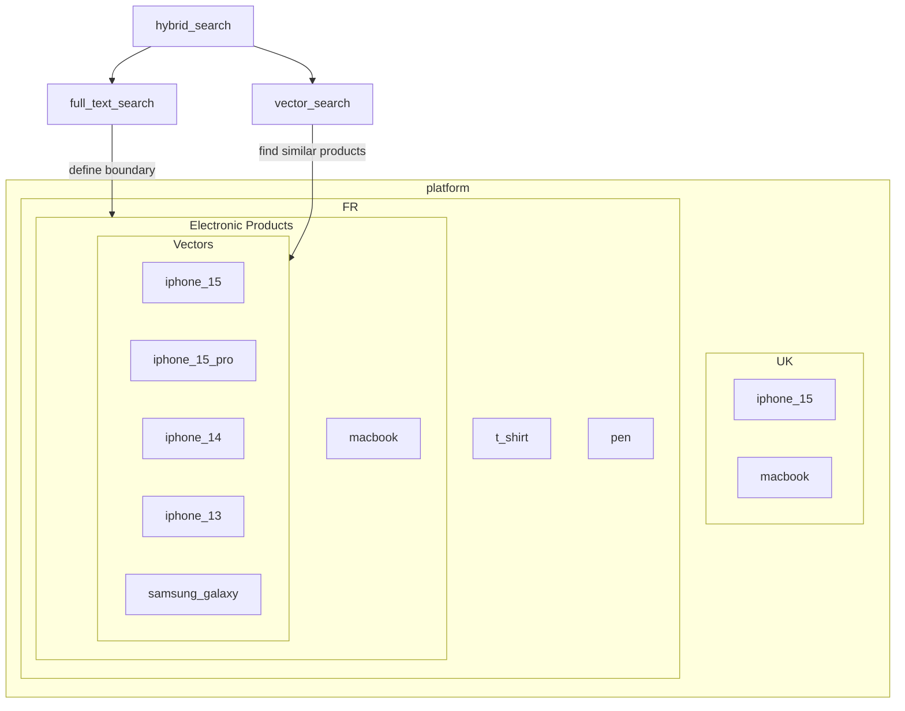

## Introduction

Recently, I heard about this technology several times on different occasions. It makes me wonder what a vector is and how it is useful in artificial intelligence (AI). This is a study note that will help me to understand this technology better, so the content may not be accurate. But I hope that it can help you to understand this technology as well. In this article, we are going to explore the definition of a vector, the motivation for using vectors in different databases, and the use cases of vectors in different industries. Now, let's get started!

## Definition

According to Wikipedia, vectors are mathematical representations of data in a high-dimensional space. In this space, each dimension corresponds to a feature of the data, with the number of dimensions ranging from a few hundred to tens of thousands, depending on the complexity of the data being represented. A vector's position in the space represents its characteristics. Words. phrases, or entire documents, as well as images, audio, and other types of data can all be vectorized.



Vectors belong to a larger category of _tensors_. In machine learning (ML), "tensor" is used as a generic term for an array of numbers—or an array of arrays of numbers—in n-dimensional space, functioning like a mathematical bookkeeping device for data.

- A scalar is a zero-dimensional tensor containing a single number. 
- A vector is a one-dimensional tensor containing multiple scars in the same type of data.
- A tube is a first-order tensor containing scalars of more than one type of data, such as a mix of strings and numbers
- A matrix is a two-dimensional tensor containing multiple vectors of the same type of data.
- Tensors with three or more dimensions, like 3-dimensional tensors used to represent color images in computer vision algorithms, are referred to as multidimensional arrays or N-dimensional tensors.

## Vectorization

If you want to convert text into vectors, you would typically interact with the LLM at a specific stage in the following process.

* **Tokenization:** The tax is first tokenized, which means breaking down into text, into smaller units. Tokens are usually words or sub-words. This is the first step, but it's not yet the factorization process. 
* **Embedding (Vectorization):** After tokenization, the test is passed through an **embedding layer**. This is where the interaction with the LLM happens. The LLM takes the tokens and converts them into dense numerical representations—**vectors**. These vectors are high dimensional (e.g. 768 dimensions in the case of BERT or GBT-3's default embeddings), and contain semantic information about the text.

Here is an example from Anshu's article [Understanding the Fundamental Limitations of Vector-Based Retrieval for Building LLM-powered Chatbot](https://medium.com/thirdai-blog/understanding-the-fundamental-limitations-of-vector-based-retrieval-for-building-llm-powered-48bb7b5a57b3), where a corpus of text documents being broken down into smaller blocks of text (chunk). Each trunk is then fed to a trained language model like BERT or GPT to generate vector representation, also known as embedding. The embedding is then stored into the vector database.


However, any changes or update to the LLM require reindexing everything in the vector database. You need the exact same for querying, changing dimensions is not allowed. So you can imagine the cost of using LLM to power your solution.

## Why (not) using vector?

Vectors can be used to determine the similarity of different objects. You can convert any kind of data from text, image, and audio data to unstructured data into vectors. Then, determine their semantic similarity by measuring the distance between vectors. The K-nearest neighbors (KNN) are the ones that are the most similar to the vector that you are looking for.

This is useful for finding words that are similar to each other even if their representation are completely different. For example, "king" and "queen" are similar but they look different. The word "king" in English and "roi" in French are also similar. This kind of sementic similarity is difficult to achieve in traditional full-text search, yet, They are very useful for many activities such as recruiting, e-commerce, etc.

There are also cases that you don't want to use vectors. When you know precisely what are you searching for, you want to ensure the searching criteria are precise and strictly applied by the database / search engine. You dont want any irrelevant results to appear, even if they look similar. For example, if you are looking for Kings in France, you don't want any kings  from England even if they are similar. You want exact matches in this case.

## Vector Database

A vector database is a specific kind of database that saves information in a form of multi-dimensional factors representing certain characteristic or qualities. According to the article [The Top 5 Vector Databases](https://www.datacamp.com/blog/the-top-5-vector-databases) by Moez Ali, there are a lot of vector databases in the market. They are either dedicated vector database or existing databases that support vector search.


It plays a crucial role in finding similar assets by querying for neighboring factors. Vector databases are typically used to power vector search use cases like visual, semantic and multimodal search. These kinds of search can be used at a stand-alone search query or a hybrid search by combining it with a full-text search.

Recently I had the chance widness the updates from Elasticsearch and MongoDB, so I'm going to explore those engines and show you how they store vectors there.

## Vector in Elasticsearch

You can store vectors in Elasticsearch. If you are interested in the product aspects of Vector Search in Elasticsearch, you can see this page: [What is vector search?](https://www.elastic.co/what-is/vector-search). In this section, we are more focused on the technical side. In the latest version of Elasticsearch, you can use a `dense_vector` field to store dense vectors of numeric values. Dense vector fields are primarily used for k-nearest neighbor (kNN) search. Here are examples about how to set up and use vectors in Elasticsearch. First of all, you need to declare the type of field as a `dense_vector` with the number of dimensions.

```sh
PUT my-index
{
  "mappings": {
    "properties": {
      "my_vector": {
        "type": "dense_vector",
        "dims": 3
      },
      "my_text" : {
        "type" : "keyword"
      }
    }
  }
}
```

And then you'll need to put the document into the index with the vector. In these two documents, the vector is the embedding of the text, probably pre-processed by a LLM.

```sh
PUT my-index/_doc/1
{
  "my_text" : "text1",
  "my_vector" : [0.5, 10, 6]
}

PUT my-index/_doc/2
{
  "my_text" : "text2",
  "my_vector" : [-0.5, 10, 10]
}
```

Then on the read path, you can use a KNN search to find the K nearest neighbors of a given vector. You can also combine a full-text search with a vector search to perform a hybrid search.

Here is an example provided by the Opster team in their article [How to set up vector search in elasticsearch?](https://opster.com/guides/elasticsearch/operations/how-to-set-up-vector-search-in-elasticsearch/#Simple-k-NN-search), where you can query for a given vector to find the K nearest ones. In this case the. target vector is `[0.1, 3.2, 2.1]` and K=2. The number of candidates refer to the mamimum number of vector candidates in each shard to be compared.

```sh
POST my-index/_search
{
  "_source": false,
  "fields": [ "price" ],
  "knn": {
    "field": "title_vector",
    "query_vector": [0.1, 3.2, 2.1],
    "k": 2,
    "num_candidates": 100
  }
}
```

After finding K candidates from each shard, the coordinator node will merge all short-local results and return a global result as a final result to the user. (Diagram created by Opster)


Documents are ranked by the vector field similarity to the query vector. There are different algorithms for calculating the vector similarity: `l2_norm`, `dot_product`, `cosine`, and `max_inner_product`. See [official documentation](https://www.elastic.co/guide/en/elasticsearch/reference/current/dense-vector.html).

In the paragraph above, we talk about vector search. This is great for finding information  when you are more or less clear what you are looking for. Now let's talk about hybrid search, a combination of full-text search and vector search.

The motivation behind hybrid search is quite clear: users often have a precise idea of what they want in certain aspects of their query, but they may be less certain about others. For example, in an e-commerce scenario, a user might want to buy products from a specific marketplace, within a particular category, and at a fixed price range. However, they might be more flexible with the search query used to describe the product.



Elastic is also building the Elasticsearch Relevance Engine (ESRE), designed to power artificial intelligence-based search applications. Use ESRE to apply semantic search with superior relevance out of the box (without domain adaptation), integrate with external large language models (LLMs), implement hybrid search, and use third-party or your own transformer models. Here is an example of the GenAI architecture with Google Cloud and Elasticsearch for the retail, presented by Delphin Barankanira during the Meetup ElasticFR 91 on June 23, 2024 (video: <https://youtu.be/Uti0fB5HpRY?si=E0_7g3Ja24zpD3sM>)


In this architecture, you can see how LLM is integrated into the database of the retailer company to provide a sementic search experience. Not only the system allows users ask questions and use the LLM to provide relevant answers, it allows the retail company to check the availability of the products using hybrid search and control the access using role-based-access-control (RBAC) via the LDAP. This becomes the relevant context and is then used by the VertexAI, developed by Google to provide the final answer to the customer.

## Vector in MongoDB

MongoDB annonced their support for vectors recently. You can see their introduction to [Vector Search](https://www.mongodb.com/products/platform/atlas-vector-search) here. According to MongoDB's documentation, the vector field must contain an array of numbers of the BSON double data type for querying using the `$vectorSearch` pipeline stage. You must index the vector field as the vector type inside the fields array. The following syntax defines the vector field type:

```js
{
  "fields":[
    {
      "type": "vector",
      "path": <field-to-index>,
      "numDimensions": <number-of-dimensions>,
      "similarity": "euclidean | cosine | dotProduct"
    },
    ...
  ]
}
```

From user's perspective, this is very similar to the configuration shown in Elasticsearch. The field "numDimensions" defines the number of dimensions in the vector, and the similarity is the default algorithm used for comparing the similarity of vectors when searching for top K-nearest neighbors.

Once the data are persisted into MongoDB, you can perform a `$vectorSearch` query to search the information for the given index. MongoDB supports two types of vector searches: ANN Search and ENN Search. For ANN search, Atlas Vector Search finds vector embeddings in your data that are closest to the vector embedding in your query based on their proximity in multi-dimensional space and based on the number of neighbors that it considers. For ENN search, Atlas Vector Search exhaustively searches all the indexed vector embeddings by calculating the distance between all the embeddings and finds the exact nearest neighbor for the vector embedding in your query. This is computationally intensive.

```js
{
  "$vectorSearch": {
    "exact": true | false,
    "filter": {<filter-specification>},
    "index": "<index-name>",
    "limit": <number-of-results>,
    "numCandidates": <number-of-candidates>,
    "path": "<field-to-search>",
    "queryVector": [<array-of-numbers>]
  }
}
```

But most of the time, you probably want to use a hybrid search, which is the combination of full-text search and vector search and fuses the results of both sides. In MongoDB, this is called Reciprocal Rank Fusion, which relies on the rank of the documents and their score to compute the final results. To calculate the fusion score, they apply a formula to every result in the search stage. The `rank` is the position of the search result, the `k` is the weight or priority to each of the search stages. Finally, it calculates the per-stage value by summing the `rank` and the `k` value together then computing the reciprocal. This can be seen in the table below, where the 3 documents A, B, and C and each of them is ranked differently in the text search (Atlas Search) and the vector search (Atlas Vector Search).


If you were interested in knowing more, you can register to MongoDB's online course [Using Vector Search for Semantic Search](https://learn.mongodb.com/courses/using-vector-search-for-semantic-search), which is a free 1.75 hours course to teach you how to build a semantic search feature with Atlas Vector Search.

## Thoughts

After learning these concepts, it means me realize several things as a normal software engineer with little AI knowledge:

1. AI Engineers are Software Engineers. Most of the hard work for AI projects is handled by LLM or databases, which respectively handle the produciton of vectors and the storage of vectors. Therefore, as an AI engineer in a company, your role is mainly to choose how to integrate LLM and vectors into the existing system architecture to better fit the business requirements.
2. Using AI sounds extremely expensive. You have to call a LLM as the encoder for creating the vectors, both for the existing data and the user queries. The vectors have to be produced by the same LLM otherwise the queries in the database will fail. So you have to choose a LLM model, e.g. `gpt-4o` and stick with it. Then, when a new LLM model is chosen (because it's newer, more cost-effective, etc), you will have to stop the world and replace everything again in your database.
3. Not all the applications need sementic search. Sementic search is a revolutional tool for domains where users cannot precisely define what they want. This is due to the lack of knowledge for the things that they are looking for, or the flexibility of the scope that they can allow in their queries, etc. It's typically useful for e-commerce, recruiting, content management. But in other cases, it may not be that important.
4. Companies owning the data are the kings. As you can see, the vectors are used as the embeddings of the existing data. So if you don't have data, then it's hard to get an opportunities to leverage LLM for business.

## Conclusion

In this article, we discuss the introduction to vectors and how it is used in Elasticsearch and MongoDB. Interested to know more? You can subscribe to [the feed of my blog](/feed.xml), follow me
on [Twitter](https://twitter.com/mincong_h) or
[GitHub](https://github.com/mincong-h/). Hope you enjoy this article, see you the next time!

## References

- <https://en.wikipedia.org/wiki/Vector_database>
- <https://www.ibm.com/think/topics/vector-embedding>
- <https://www.mongodb.com/docs/atlas/atlas-vector-search/vector-search-overview/>
- <https://www.elastic.co/search-labs/blog/elasticsearch-vector-large-scale-part1>
- <https://www.elastic.co/elasticsearch/elasticsearch-relevance-engine>
- <https://opster.com/guides/elasticsearch/operations/how-to-set-up-vector-search-in-elasticsearch/>
- <https://www.mongodb.com/docs/atlas/atlas-vector-search/vector-search-stage/>
- <https://youtu.be/Uti0fB5HpRY?si=E0_7g3Ja24zpD3sM> Meetup ElasticFR #91 - Advancing Enterprise and OSS with Google Cloud's GenAI and Elastic