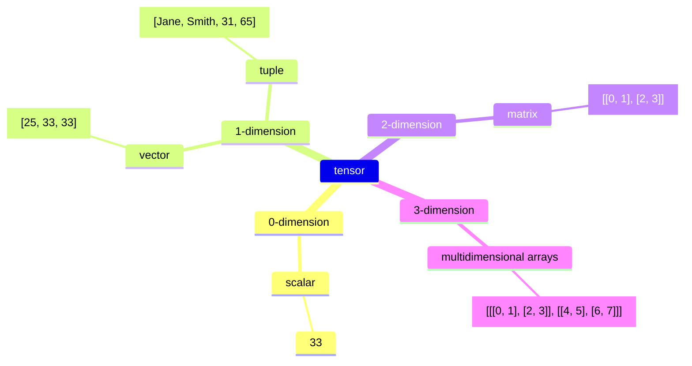

## Introduction

Recently, I heard about this technology several times in different occasions. It makes me wonder what vector is and how it is useful in artificial intelligence (AI). This is a sturdy note for helping myself to better understand this technology, so the content may not be accurate. But I hope that it can help you to understand this technology as well. In this article, we are going to explore the definition of a vector, the motivation of using vector in different databases, and the use cases of vectors in different industries. Now, let's get started!

## Definition

According to Wikipedia, vectors are mathematical representation of data in a high-dimensional space. In this space, each dimension corresponds to a feature of the data, with the number of dimensions ranging from a few hundreds to tens of thousands, depending on the complexity of the data being represented. A vector's position in the space represents its characteristics. Words. phrases, or entire documents, as well as images, audio, and other types of data can all be vectorized.



Vectors belong to a larger category of _tensors_. In machine learning (ML), "tensor" is used as a generic term for an array of numbers—or an array of arrays of numbers—in n-dimensional space, functioning like a mathematical bookkeeping device for data.

- A scalar is a zero-dimensional tensor containing a single number. 
- A vector is a one dimensional tensor containing multiple scars in the same type of data.
- A tube is a first-order tensor containing scalars of more than one type of data, such as a mix of strings and numbers
- A matrix is a two-dimensional tensor containing multiple vectors of the same type of data.
- Tensors with three or more dimensions, like a 3-dimensional tensors used to represent color images in computer vision algorithms, are referred to as multidimensional arrays or N-dimensional tensors.

## Vectorization

If you want to convert text into vectors, you would typically interact with the LLM at a specific stage in the following process.

* **Tokenization:** The tax is first tokenized, which means breaking down into text, into smaller units, token usually words or sub words. This is the first step, but it's not yet the factorization process. 
* **Embedding (Vectorization):** After tokenization, the test is passed through an **embedding layer**. This is where the interaction with the LLM happens. The LLM takes the tokens and converts them into dense numerical representations—**vectors**. These vectors are high dimensional (e.g. 768 dimensions in the case of BERT or GBT-3's default embeddings), and contain semantic information about the text.

Here is an example from Anshu's article [Understanding the Fundamental Limitations of Vector-Based Retrieval for Building LLM-powered Chatbot](https://medium.com/thirdai-blog/understanding-the-fundamental-limitations-of-vector-based-retrieval-for-building-llm-powered-48bb7b5a57b3), where a corpus of text documents being broken down into smaller blocks of text (chunk). Each trunk is then fed to a trained language model like BERT or GPT to generate vector representation, also known as embedding. The embedding is then stored into the vector database.


However, any changes or update to the LLM require reindexing everything in the vector database. You need the exact same for querying, changing dimensions is not allowed. So you can imagine the cost of using LLM to power your solution.

## Why (not) using vector?

Vectors can be used to determine the similarity of different objects. You can convert any kind of data from text, image, and audio data to unstructured data into vectors. Then, determine their semantic similarity by measuring the distance between vectors. The K-nearest neighbors (KNN) are the ones that are the most similar to the vector that you are looking for.

This is useful for finding words that are similar to each other even if their representation are completely different. For example, "king" and "queen" are similar but they look different. The word "king" in English and "roi" in French are also similar. This kind of sementic similarity is difficult to achieve in traditional full-text search, yet, They are very useful for many activities such as recruiting, e-commerce, etc.

There are also cases that you don't want to use vectors. When you know precisely what are you searching for, you want to ensure the searching criteria are precise and strictly applied by the database / search engine. You dont want any irrelevant results to appear, even if they look similar. For example, if you are looking for Kings in France, you don't want any kings  from England even if they are similar. You want exact matches in this case.

## Vector Database

A vector database is a specific kind of database that saves information in a form of multi-dimensional factors representing certain characteristic or qualities. According to the article [The Top 5 Vector Databases](https://www.datacamp.com/blog/the-top-5-vector-databases) by Moez Ali, there are a lot of vector databases in the market. They are either dedicated vector database or existing databases that support vector search.


It plays a crucial role in finding similar assets by querying for neighboring factors. Vector databases are typically used to power vector search use cases like visual, semantic and multimodal search. These kinds of search can be used at a stand-alone search query or a hybrid search by combining it with a full-text search.

Recently I had the chance widness the updates from Elasticsearch and MongoDB, so I'm going to explore those engines and show you how they store vectors there.

## Vector in Elasticsearch

You can store vectors in Elasticsearch. If you are interested in the product aspects of Vector Search in Elasticsearch, you can see this page: [What is vector search?](https://www.elastic.co/what-is/vector-search). In this section, we are more focused on the technical side. In the latest version of Elasticsearch, you can use a `dense_vector` field to store dense vectors of numeric values. Dense vector fields are primarily used for k-nearest neighbor (kNN) search.

```sh
PUT my-index
{
  "mappings": {
    "properties": {
      "my_vector": {
        "type": "dense_vector",
        "dims": 3
      },
      "my_text" : {
        "type" : "keyword"
      }
    }
  }
}

PUT my-index/_doc/1
{
  "my_text" : "text1",
  "my_vector" : [0.5, 10, 6]
}

PUT my-index/_doc/2
{
  "my_text" : "text2",
  "my_vector" : [-0.5, 10, 10]
}
```

## Going Further

How to go further from here?

## Conclusion

What did we talk in this article? Take notes from introduction again.
Interested to know more? You can subscribe to [the feed of my blog](/feed.xml), follow me
on [Twitter](https://twitter.com/mincong_h) or
[GitHub](https://github.com/mincong-h/). Hope you enjoy this article, see you the next time!

## References

- <https://en.wikipedia.org/wiki/Vector_database>
- <https://www.ibm.com/think/topics/vector-embedding>
- <https://www.mongodb.com/docs/atlas/atlas-vector-search/vector-search-overview/>