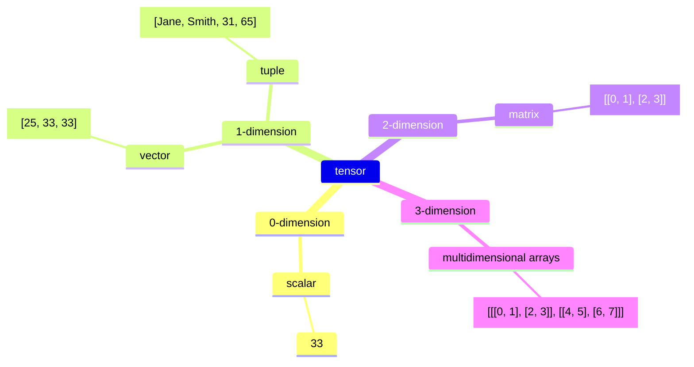

## Introduction

Recently, I heard about this technology several times in different occasions. It makes me wonder what vector is and how it is useful in artificial intelligence (AI). This is a sturdy note for helping myself to better understand this technology, so the content may not be accurate. But I hope that it can help you to understand this technology as well. In this article, we are going to explore the definition of a vector, the motivation of using vector in different databases, and the use cases of vectors in different industries. Now, let's get started!

## Definition

According to Wikipedia, vectors are mathematical representation of data in a high-dimensional space. In this space, each dimension corresponds to a feature of the data, with the number of dimensions ranging from a few hundreds to tens of thousands, depending on the complexity of the data being represented. A vector's position in the space represents its characteristics. Words. phrases, or entire documents, as well as images, audio, and other types of data can all be vectorized.

Vectors belong to a larger category of _tensors_. In machine learning (ML), "tensor" is used as a generic term for an array of numbers—or an array of arrays of numbers—in n-dimensional space, functioning like a mathematical bookkeeping device for data.

- A scalar is a zero-dimensional tensor containing a single number. 
- A vector is a one dimensional tensor containing multiple scars in the same type of data.
- A tube is a first-order tensor containing scalars of more than one type of data, such as a mix of strings and numbers
- A matrix is a two-dimensional tensor containing multiple vectors of the same type of data.
- Tensors with three or more dimensions, like a 3-dimensional tensors used to represent color images in computer vision algorithms, are referred to as multidimensional arrays or N-dimensional tensors.

## Why using vectors?

## Section 3

## Going Further

How to go further from here?

## Conclusion

What did we talk in this article? Take notes from introduction again.
Interested to know more? You can subscribe to [the feed of my blog](/feed.xml), follow me
on [Twitter](https://twitter.com/mincong_h) or
[GitHub](https://github.com/mincong-h/). Hope you enjoy this article, see you the next time!

## References

- <https://en.wikipedia.org/wiki/Vector_database>
- <https://www.ibm.com/think/topics/vector-embedding>