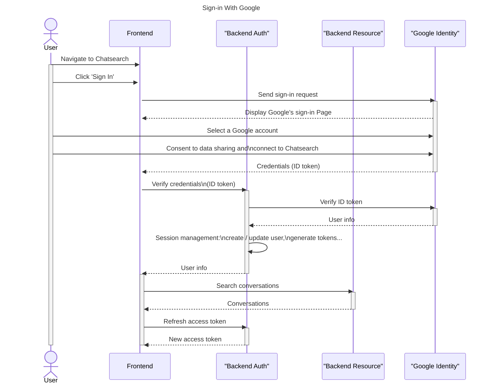
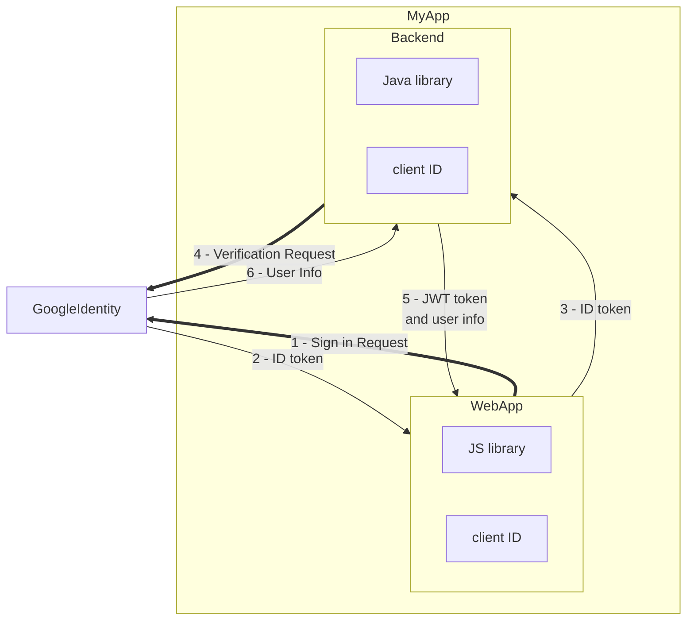

## Introduction

Recently, I had the chance to implement a "Sign in with Google" flow for two projects, so I would like to share my experience about the core concepts for implementing such an authentication flow for web applications between the front-end, the back-end, the authentication server and Google. After reading this post, you will understand the roles of different actors, the sequence of exchange, and the JWT token for the exchange. **Note that this is my experience for personal projects, using it for production-grade application is at your own risk.** Now, let's get started!

## Motivation

_Why do you want to use Google to sign-in your application?_

When using Google to sign in your web application, you are relying on OAuth (Open authorization) which is an open standard for assess delegation, commonly used as a way for internet users to grant websites or applications access to their information on your website, but without giving you the password.

The main reason of choosing in this approach is to avoid managing users' credentials which can be pretty complex. As a developer, if you store users credentials, you will need to think about the password complexity (prevent weak password), the forgotten password, preventing password leak, password renewal, and many other aspects related to identity management. This can be overwhelming for small companies.

Therefore, you may want to choose an identity provider (IdP), such as Google Identity, to manage the password for you. On your side, you will primarily focus on storing the user's information provided by Google, but you don't have to worry about the credentials: Google handles that for you. Note that Google is not the only identity provider in the market, there are other choices: [Auth0](https://auth0.com/), [Amazon Cognito](https://docs.aws.amazon.com/cognito/), etc. But in this article, we are primarily interested in Google Identity. Once you understand the core concepts, it should be easy to apply these concepts to other vendors.

## Key Components

The key interactions happens between the web application (frontend), the identity server and the backend application. The web application interacts with Google Identity and the backend, which is served as the front of exchanging the user identity from Google and communication with the backend service. The backend service is devided into the authorization service and the actual resource service. The authorization service is responsible for exchanging with Google Identity to verify the identity submitted by the web application (frontend) and decoding the access token (JWT token) sent by each HTTP request. The actual backend resource service is responsible for providing the actual resource. And finally, Google Identity is responsible for storing the user password, consent, and user information. Here is a diagram expressing the interactions between the user, the web application, the authorization service of the backend, the resource service of the backend, and the Google Identity. This is using the "ChatGPT QuickSearch Extension" that I created recently as an example.



## Frontend


The web application follows the guide [Sign In With Google for web](https://developers.google.com/identity/gsi/web/guides/overview) to display and handle the sign-in process. It includes loading the library, rendering the button, interacting with the backend for ID token verification, and more. The web application relies on an OAuth 2.0 Client ID, registered in a Google Cloud project, such as `xxx.apps.googleusercontent.com`. This ID allows Google to perform validation based on the project settings, such as the authorized JavaScript origins (for use with requests from a browser) and the authorized redirect URIs (the backend URIs). The web application also needs to handle the state management, which stores the access token and removes it after signing out.

## Backend Authorization

The backend authorization service receives the ID token sent by the web application. It sends to Google Identity another request to verify the ID token validity. This method is recommanded by Google in their article [Verify the Google ID token on your server side](https://developers.google.com/identity/gsi/web/guides/verify-google-id-token). Once the token is verified, we can receive the user information from Google, such as the user email, family name, first name, locale, and picture. These pieces of information can be persisted in database. Here is a screenshot showing the interactions between the backend and Google using Datadog: First of all, the backend receives the token verification request submitted by the frontend. Then, it sends a request to Google Identity to verify the token. Once the token is verified, Google returns the user information, which is persisted into MongoDB.


Service is not only responsible for handling the ID token sent by Google. It is also a central place for granting access tokens, refresh tokens, and handle all kinds of authorization logic in the OAuth flow. When the frontend sends an HTTP request with the authorization header, the header is decoded by the authorizer to verify the access token and all the fields there. Note that this is not directly related to "Sign in with Google", it is how I implement the OAuth logic with my custom authorizer. The similar services should be AWS Cognito or Google Identity Platform.

As a developer, you need to design your jwt token. You need to define the roles, the scope of access, expiry, subject, issuer, and other types of information that you want to store in a token. You also need to design the public responses when the authorization fails.

## Backend Resource

Backend resource APIs are the actual services for handling CRUD of different resources. They do not contain any logic related to authorization. But they should declaration instructions (such as via annotations) to let the authorizor to grant or deny access to the resource. For example, some resources are restricted for administrators, while other resources are open for any registered users. This can be related to the scope of the token, or other information.

For example, in the spring framework, you can use preauthorized, secured or roles allowed to define role-based access control (RBAC) for your RESTful APIs.

```java
@RolesAllowed("ROLE_ADMIN")
@GetMapping("/admin/data")
public ResponseEntity<String> getAdminData() {
    return ResponseEntity.ok("Admin Data");
}
```

## Google Identity

You need to create a project in Google Cloud to configure the OAuth 2.0 Client IDs. The configuration is unique per application. The application can have type: web application, android, chrome extension, iOS, desktop app, etc. In my case, I am interested in web application. The client ID is registered in both the frontend and the backend, which are used for sending requests to Google Identity. The frontend sends a request to Google when user clicks the "Sign-in with Google" button. The backend sends a request to Google when the ID token and other tokens (such as the CSRF token) is received by the backend to a double-verification.



There are two pieces of information that are essentials in the Google Cloud: the Authorized JavaScript origins and the Authorized redirect URIs.

* **Authorized JavaScript origins** define the HTTP origins that host your web application. It should point to your local development environment, staging environment, and production environment. In my case, I put `http://localhost`, `http://localhost:5173` (webpack server), `https://cs.nanosearch.io` which are the dev and prod environments. Note that the `http://localhost` is a special expression for defining an origin for localhost.
* **Authorized redirect URIs** define to which path users will be redirected after they have authenticated with Google. The path will be appended with the authorization code for access, and must have a protocol. It can’t contain URL fragments, relative paths, or wildcards, and can’t be a public IP address. In my case, I put `http://localhost:8080/api/v1/auth/google/verify-token`, and `https://cs.nanosearch.io/api/v1/auth/google/verify-token`.

## Conclusion

In this article, we discussed some of the important components in a "Sign-in with Google" flow for a web application, including the frontend application, the backend authorization service, the actual backend resources, and the Google Identity. Interested to know more? You can subscribe to [the feed of my blog](/feed.xml), follow me
on [Twitter](https://twitter.com/mincong_h) or
[GitHub](https://github.com/mincong-h/). Hope you enjoy this article, see you the next time!

## References

* <https://developers.google.com/identity/gsi/web/guides/offerings>