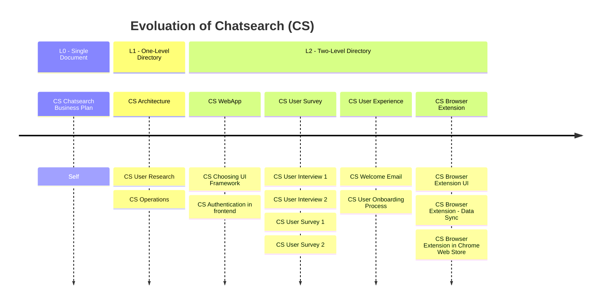

## Introduction

As a developer, you probably need to write a lot of documentation. You need to write  specifications to architect your solution. You need to write release notes to share new changes with other people. You need to write manuals for users to get started and understand the features of your software. You need to write an operational guide to allow the team to operate the software effectively. You also need to write reference documentation to dive deep into each configuration exposed to the external API. It’s a lot of time and effort to manage them. Therefore, it is important to have some sort of framework to allow you to manage this effectively. Today, I’m going to share with you my thoughts and experience about managing and scaling documents in Google Docs.

## The 3-Level Framework

I think everyone should assume that documentation is not done overnight: instead, it grows with your software. At the beginning, the project was small, so there was little documentation to write. When the project becomes more complex, so does the documentation. Because people are not machines, they read docs rather than code. Therefore, it is crucial to think about the evolution of the documentation and adapt the structure of the documentation accordingly to the growth of the project. If you set up something too complex at the beginning, it will be over-thinking, but if you don’t evolve overtime, then documentation would “lag” behind and cannot fit the purpose and the complexity of your project anymore. Over the last years, I have been using a 3-level framework, which is working pretty well for me. L0 is writing documentation in a single document; L1 is to put multiple documents into a directory; and L2 is to put multiple documents into a two-level directory, either the top-level directory or the subdirectories. This sounds extremely easy, right? Now, let’s explore each of them individually.

Here, I am using the ChatGPT QuickSearch Extension as an example (internally, it's called Chatsearch).

### L0 - Single Document

In the single-document pattern, you write everything in the same document. This is a standalone document containing all kinds of information related to your project. It works well when you have a limited amount of information related to this project. Perhaps you are a newcomer for the project and your current interest is limited since you are just learning. Perhaps you have an idea, so you want to describe the motivation, the problems and potential solutions, but you are not ready to implement it yet. Perhaps you want to understand the organization of the team, so you describe the structure and roles in a document. These kinds of information fit perfectly in single documentation. You don’t need a directory or an even more complex structure because one document is simple enough. If the situation evolves, you just need to add more paragraphs into that document. When the document grows a lot, like more than 5 to 10 pages, perhaps one single document does not fit it anymore. You will need a more complex structure to adapt the growth of your project.

### L1 - One-Level Directory

A one-level directory is a directory containing multiple documents, ideally more than three documents. Each document represents different aspects of the software. For example, one can be a getting-started guide while another explains the architecture from a technical standpoint, and the last one is an operational guide. All content inside this directory should be built around the same topic so that the content is highly cohesive. People will naturally be interested. If you think about your content from the readers’ respective, you typically have different kinds of readers for your documents: some readers may be product owners, some may be support engineers, sales engineers, or developers. Because their roles are different, so are their interests. Therefore, you can write your document by providing content that is highly relevant to some users. It makes the target audience clear. This will better attract their attention and provide more effective communication. Using a single document is not suitable anymore because people will be confused when navigating through the document and having a hard time to understand which part matters to them. For example, a getting-started guide is typically for users who start using your software, an operational guide (runbook) is typically for software engineers and devops who run the software, and a roadmap is typically for stakeholders of the project (managers, core team, etc).

### L2 - Two-Level Framework

Over time, the one-level directory structure probably won’t fit anymore because every aspect of your software grows and more people are joining the team. Your software may also become more complex. In this case, you can categorize them into different categories, and for each category, you create a separated directory for it. For example, if you have multiple requests for comments (RFCs), you can put them under the RFCs directory. If you have multiple operational guides, you can create another one called “operations” for running the service in production. You can create another directory for your users, talking about getting started with the software and how to be familiar with the core concepts. You can also create another one about the organization, including roadmap, OKRs, discussions etc.

## Going Further

How to go further from here?

## Conclusion

What did we talk in this article? Take notes from introduction again.
Interested to know more? You can subscribe to [the feed of my blog](/feed.xml), follow me
on [Twitter](https://twitter.com/mincong_h) or
[GitHub](https://github.com/mincong-h/). Hope you enjoy this article, see you the next time!

## References
