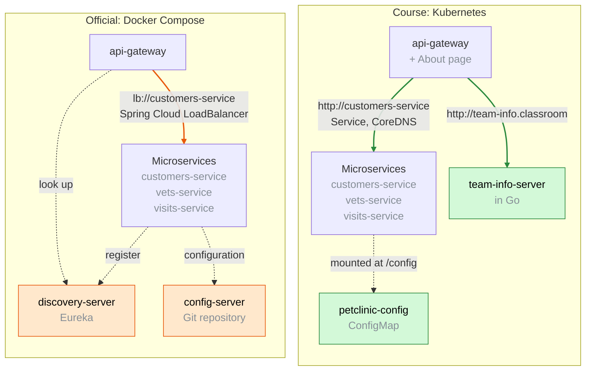
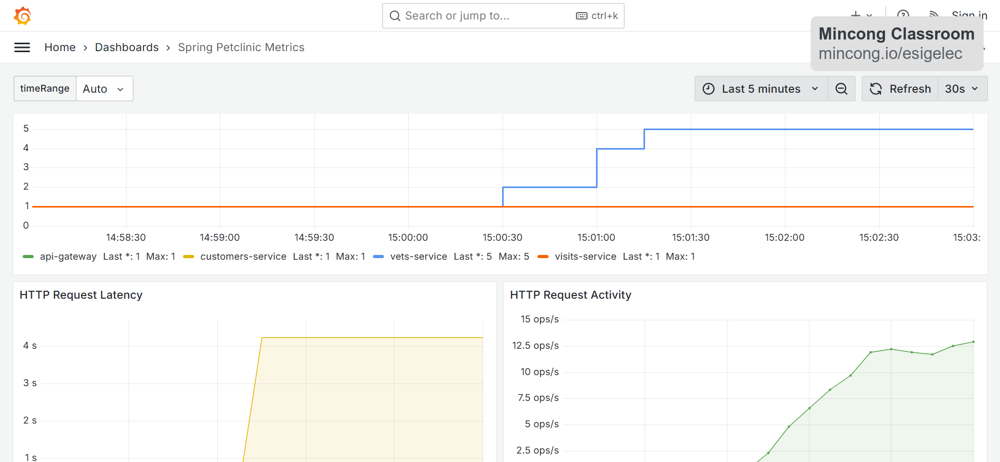
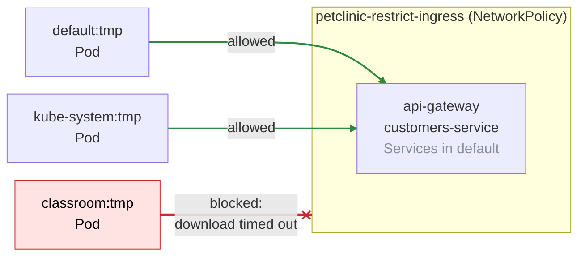
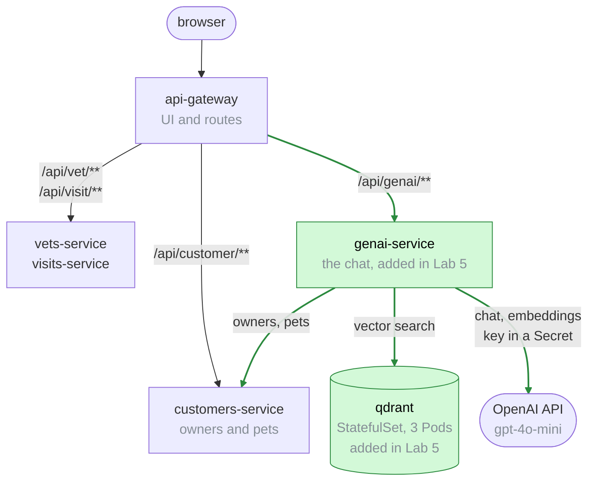
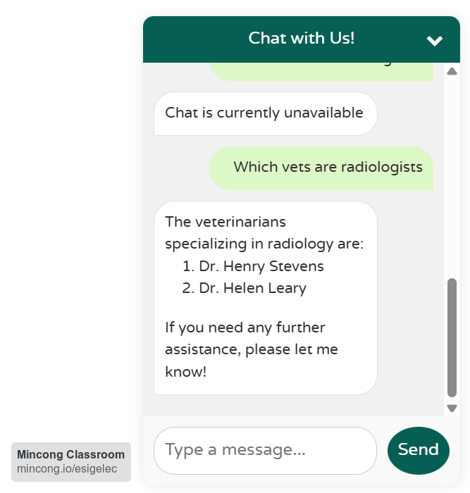
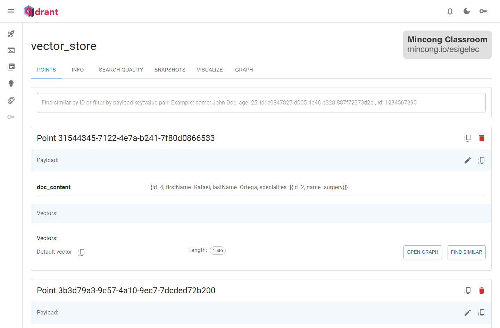
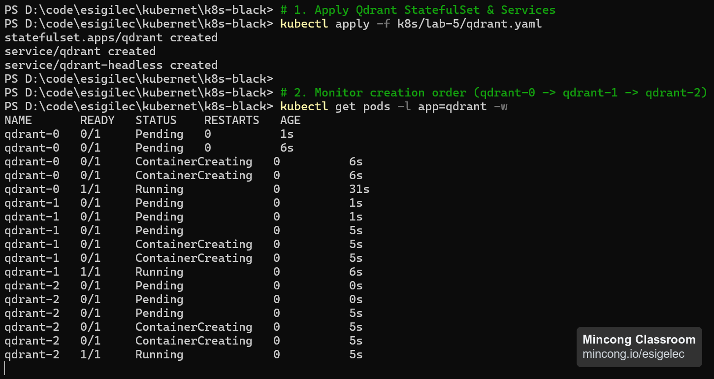
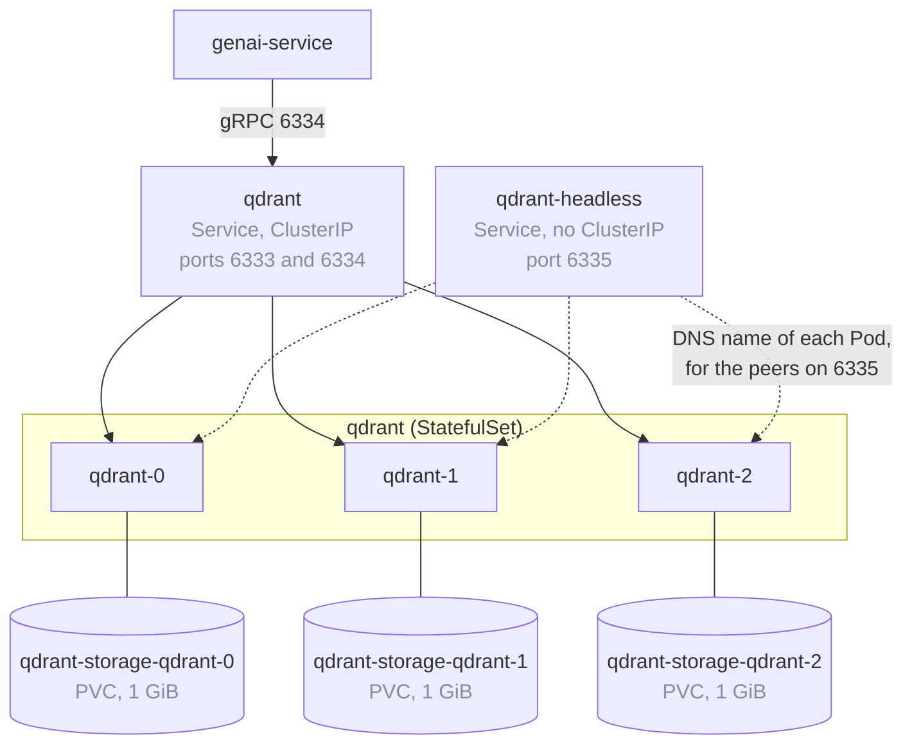

<style type="text/css">
  /* A thin gray border around each figure, to tell the screenshots and the diagram apart from the text. */
  .article__content p[align="center"] img,
  .article__content code.language-mermaid[data-processed] {
    border: 1px solid #d0d7de;
  }

  /*
   * The caption of a figure is centered and narrower than the text, so that it reads as a part of
   * the figure. The browser moves each <figcaption> out of its <p align="center">: select it alone.
   */
  .article__content figcaption {
    margin-left: 15%;
    margin-right: 15%;
    text-align: center;
  }

  @media (max-width: 600px) {
    .article__content figcaption {
      margin-left: 5%;
      margin-right: 5%;
    }
  }
</style>

## Introduction

In the end of October, I had the privilege to go to ESIGELEC, an engineering school in Saint-Étienne-du-Rouvray, Normandy, France, to share knowledge about Kubernetes with about 20 students. This is a 20-hour module for the students majoring in the Digital Services Engineering (Ingénieurie des Services du Numérique). In this article, I want to recapitulate the program of this course, the changes compared to last year, and some highlights from the students.

<!--
> **Writing hint**
>
> - **What:** who you are, for a reader who doesn't know you: a software engineer who teaches this module at ESIGELEC for the second year (the [2025 recap](/en/esigelec-kubernetes-2025/)). Then what the reader will find: the program, the student highlights, and the tooling that helps me to teach and to grade. The introduction says "about 20 students": it's 21. The front matter is still the one of 2025: the same `image`, `subtitle` and `excerpt`, and the excerpt says "lessons learned" and "redesigned curriculum". The plugin `jekyll-seo-tag` turns `image` and `excerpt` into the preview card on LinkedIn, so the 2 recaps would show the same card.
> - **Why:** the post is public and shared on LinkedIn, so it reaches 4 kinds of readers: the director of a school or the head of a department who may hire you, engineering students, your colleagues, and the professionals of your network and of their network. Most of them decide from the card and the first 2 lines whether to click. A card identical to last year's looks like an old post.
> - **How:** 2 or 3 sentences: who you are, the course in numbers, what the post shows. A new `excerpt` of 1 or 2 sentences that names the highlights (GenAI, observability, the evaluation with `mc`), and a new `image` from this year, e.g. Figure 9, or a photo of the class with the consent of the students. LinkedIn shows the card at about 1.91:1 (1200 × 627 px), while `esigelec.jpeg` is 3:1 (2000 × 667 px).
-->

## Program

This module lasts for 20 hours. It consists of five chapters, each lasting 4 hours, including 1 hour of lecture and 3 hours of lap session. In this module, we discuss containerizing applications with Docker, the key components of a Kubernetes cluster, and then dive into workload deployment, networking, configuration, and storage in greater detail.

* **Containerization with Docker.** In this part, students learned how to create Docker images for Java applications. They learned how to package a Java application as a JAR, and what the Java Runtime Environment (JRE) is. Then, they learn concepts related to Docker Runtime, Docker Registry, Docker CLI, Docker Desktop, and Dockerfile.
* **Kubernetes Overview.** In this part, they learn the key components of Kubernetes, including the API server, etcd, scheduler, controller manager, kubelet, node; the command line tool `kubectl`. Then, they developped and operated Pods in the Lab Session.
* **Deployment in Kubernetes.** This part focuses on workloads. We discussed deployment and operational challenges in companies and how Kubernetes addresses some of these challenges using ReplicaSets and Deployments. We also talked about workload scaling and microservices architecture.
* **Networking in Kubernetes.** This part discusses different networking components in Kubernetes to adapt to different use cases in a Kubernetes cluster, including Service, Node Port, and Load Balancer. They also learned Namespace and Network Policy, concepts for isolation and control.
* **Configuration and Storage.** Finally, this part discusses different ways to configure the resources in the cluster, for standalone or shared configuration, for sensitive and non-sensitive information. Then, we talked about Stateful Set, a powerful concept for running stateful applications.

Through this program, students gain a better understanding of the challenges associated with software operations. It not only applies to Kubernetes, but also other kinds of orchestration services (Google Cloud Run, AWS App Runner, AWS ECS, …). To access the whole program, please visit <https://mincong.io/esigelec/2026>

<!--
> **Writing hint**
>
> - **What:** a few numbers at the end of this section: 20 hours, 21 students in 13 teams, 5 chapters and 226 slides, 31 lab exercises, 284 commits by the students. The growth from 2025 shows a course that is maintained: 207 to 226 slides, 24 to 31 exercises. Also: everything runs on the students' own laptops, Windows or macOS, with the Kubernetes cluster of Docker Desktop.
> - **Why:** a director first wants the format and the scale: hours, group size, topics. A student wants to know what they will be able to do after 20 hours. The public slides of the year (mincong.io/esigelec/2026, draft PR #174) let both judge the material by themselves, and a director can do it before contacting you. And no Kubernetes cluster to rent in the cloud means no infrastructure budget for the school.
> - **How:** a short list of numbers, without sentences around them, then one sentence that points to the public slides.
-->

## Highlights

Here are some highlights and changes from this year. It's either some improvements I did this year or some highlights from the student that I think are worth sharing with you.

<!--
> **Writing hint for the whole section "Highlights"**
>
> - **Readers:** 4 kinds, coming from LinkedIn: 1) the director of a school or the head of a department who may hire you, in France or abroad; 2) engineering students, at ESIGELEC or elsewhere, including the 21 students of this year, who will look for their team; 3) your colleagues; 4) the professionals of your network and of their network. They scroll: they look at the figures, read the headings and the captions, and maybe one sentence per section.
> - **Message:** for a director, "If I hire Mincong, my students will practice what the industry asks for (Kubernetes, observability, GenAI, security), they will learn to analyze rather than copy commands, and the course comes with modern material and a fair evaluation." For a student, "In this course, I would build, break and fix a real system, with the tools of 2026." For a colleague or another professional, "This course teaches what we do at work."
> - **How:** one section = one skill, one figure, and one or two sentences of proof. Put the strongest sections first: GenAI and Qdrant, then Observability. The sentence above can say what the students achieved this year rather than "changes from this year". Keep the tone positive: what didn't work stays in the course repository.
> - **Public post:** credit the students by the color of their team, not by name, and tag them on LinkedIn only if they agree. The figures show no names and no private URLs: I masked the repository of purple, and the owners in Figure 9 are the demo data of the PetClinic. The paths such as `k8s-green/docs/lab-3.md` in these hints point to the private repositories of the teams: they're for you, not links for the readers.
-->

### Spring Pet Clinic Adoption

Here is the architecture of the official version, run with Docker Compose, compared to the version of the course, run in Kubernetes. The parts in orange are the ones that Kubernetes replaces. The parts in green are new in the version of the course (the ConfigMap, the HTTP calls through a Service, and the server that I added):


```mermaid
---
config:
  flowchart:
    nodeSpacing: 20
    rankSpacing: 40
---
flowchart TB
    subgraph course["Course: Kubernetes"]
        direction TB
        c_gw["api-gateway<br><span style='color:#868e96 !important'>+ About page</span>"]
        c_svc["Microservices<br><span style='color:#868e96 !important'>customers-service<br>vets-service<br>visits-service</span>"]
        c_team["team-info-server<br><span style='color:#868e96 !important'>in Go</span>"]
        c_cm["petclinic-config<br><span style='color:#868e96 !important'>ConfigMap</span>"]
        c_gw -- "http#58;//customers-service<br>Service, CoreDNS" --> c_svc
        c_gw -- "http#58;//team-info.classroom" --> c_team
        c_svc -. "mounted at /config" .-> c_cm
    end

    subgraph official["Official: Docker Compose"]
        direction TB
        o_gw["api-gateway"]
        o_svc["Microservices<br><span style='color:#868e96 !important'>customers-service<br>vets-service<br>visits-service</span>"]
        o_disc["discovery-server<br><span style='color:#868e96 !important'>Eureka</span>"]
        o_conf["config-server<br><span style='color:#868e96 !important'>Git repository</span>"]
        o_gw -- "lb://customers-service<br>Spring Cloud LoadBalancer" --> o_svc
        o_gw -. "look up" .-> o_disc
        o_svc -. register .-> o_disc
        o_svc -. configuration .-> o_conf
    end

    classDef replaced fill:#ffe8cc,stroke:#e8590c,color:#000
    classDef added fill:#d3f9d8,stroke:#2b8a3e,color:#000
    class o_disc,o_conf replaced
    class c_team,c_cm added
    linkStyle 3 stroke:#e8590c,stroke-width:2px
    linkStyle 0,1 stroke:#2b8a3e,stroke-width:2px
```

<p align="center">

  <figcaption>Figure 1: Spring PetClinic Microservices: the official version and the version of the course</figcaption>

</p>

On the Spring PetClinic Microservices side, I made some patches to run the stack in Kubernetes. Because Kubernetes is not a supported platform by this project.

1. We had to create a new profile called `kubernetes`, which provides an alternative to the existing one `docker`, which was mainly designed for Docker Compose. Typically, it disables the load balancer, the config server and replace them by the native Service resources and ConfigMap in Kubernetes.
2. In the Spring PetClinic API gateway for the frontend, a new About page was added, which allows the team to practice API integration by showing the information relevant to their team.
3. Qdrant as an external vector database. The implementation of the GenAI service has been modified to support the external vector database Qdrant. By default, it only supports an in-memory database, and this time, to better simulate the real use cases and understand the stateful set, I added another implementation for connecting to Qdrant.

<!--
> **Writing hint**
>
> - **What:** the students measured the cost of microservices themselves in Lab 3: 8 teams compared the memory of the monolith and of the microservices, and found 3 to 4 times more for the microservices, e.g. red 352 Mi against 1116 Mi, purple 424 Mi against 1285 Mi, cyan 284 Mi against 1073 Mi. Point 3 (Qdrant) can move to the subsection on Qdrant of "GenAI and Qdrant".
> - **Why:** Spring PetClinic is the reference application of the Spring community, so the students work on a realistic system rather than a toy, and every Java developer of your network knows it. And measuring a trade-off with numbers is the judgment that companies expect from an engineer: microservices aren't free.
> - **How:** one sentence after the list, with the 3 pairs of numbers. Keep Figure 1 as the only visual of this section.

-->

### Team Info

On top of that we also have a new service called a [Team Info Server](https://github.com/mincong-classroom/team-info-server), which serves as a satellite service to interact with the main services. The main purpose of this server was to have a teaching material for troubleshooting. It simulates application error, container crashes, etc. This material is also used to understand the cross-namespace exchanges; observe load balancing mechanism across multiple Pods.

The benefit of using the team info server is that it's a lightweight Go server whose size is significantly smaller than a Java container, which is only about 5 MB. By using that, it is possible to start the container quickly. It is especially interesting for students who are using their desktop because some of them have limited memory, like 8 GB or 16 GB, which is quite different from the school's computer. It is also, I think, an opportunity to show them that different services can be in different languages and they don't have to stick to one programming language inside the microservice architecture. 

For example, here is the About page of the team "purple", before and after they added the route to the Team Info Server in the API gateway, in Lab Session 4:

<p align="center">

  

  <figcaption>Figure 2: The About page of the team "purple" before the route to the Team Info Server: 404 Not Found</figcaption>

</p>

<p align="center">

  

  <figcaption>Figure 3: The About page of the team "purple" after the route to the Team Info Server: 200 OK, with the information of the team</figcaption>

</p>

Before the route, the API gateway answered 404 itself, because no route matched `/api/about/`. After the route, it forwarded the request to the Service `team-info` in the namespace `classroom`, and the page showed the information of the team. Thanks to this Team-Info integration, a student learns the route configuration in Spring and then network troubleshooting through the access logs (so they know whether the error is located in the API gateway, in the Go service, or elsewhere).

<!--
> **Writing hint**
>
> - **What:** you wrote this small server in Go for the course, so that each team sees its own About page through the API gateway (Figures 2 and 3). Its image is about 5 MB compressed on Docker Hub (amd64), against 284 MB for the API gateway: check it on Docker Hub, the draft says "about 10 MB". Its only failure is to refuse to start when `TEAM_ID` is invalid (the broken Pod of Lab 2), so drop "application error, container crashes, etc.". A student who went further: green dumped the iptables rules of kube-proxy in Lab 4 to see how the Service spreads the requests across the Pods: "The first rule picks the first Pod with probability 1/3; if not, the second rule picks the second Pod with probability 1/2" (`k8s-green/docs/lab-4.md:231`).
> - **Why:** it shows that you build material for the course instead of reusing a tutorial, and that each team gets a visible, personal result, which keeps them motivated. green's iptables show students curious enough to look under the abstraction, which is how good engineers are made.
> - **How:** replace the second paragraph with the comparison of the 2 images, keep Figures 2 and 3, then 1 or 2 sentences on green with the quote.
-->

### Observability

We also introduced the observability stack, including Grafana, Zipkin, and Prometheus. It allowed the students to understand how the microservices communicate with each other based on the traces observed in the PetClinic server; observe the scaling events and the system loads; and more.

I added Observability because this course is more oriented towards Systems Engineering than Software Engineering. Also because at the AI era, software changes much faster and therefore, we need better way to observe the changes in the architecture and understand their relationship.

<p align="center">

  

  <figcaption>Figure 4: Prometheus of the team "green" while vets-service was scaled to 0: "3/3 up", and no target for vets-service</figcaption>

</p>

This screenshot comes from Exercise 6 of Lab 3. The students created an outage on purpose: they scaled `vets-service` down to 0 replicas, then opened the page "Target health" of Prometheus. The green team got "3 / 3 up": the API gateway, `customers-service` and `visits-service` are UP, and `vets-service` is missing from the list. It is not marked as DOWN, because Prometheus discovers its targets from the running Pods, and there is no Pod of `vets-service` any more. In other words, the monitoring looks healthy while a service is down. 5 other teams noticed the same thing, and for the green team, it's the traces in Zipkin that revealed the outage.

In the following sections, you will discover more screenshots like this because most of the evidence from their lab sessions came from observability.

### Autoscaling

This year, in terms of the lecture, what we improved is that we added auto-scaling to the deployments part. Chapter 3 allows students to understand how to install the metrics server on the Kubernetes Control Plane and define auto-scaling rules based on CPU.

More precisely, the team needs to install the Metrics Server to the Kubernetes cluster and add a horizontal pod autoscaler (HPA) to a service and send loads to it. Each team has their freedom to choose an implementation for the load test, and they can send it and observe the load from the observability tool Grafana.

The teaching material is also prepared for them to succeed, meaning that I lower the maximum number of spans and the lower threshold for the upscaling (because, overall, all the events happen on the laptop). The importance is to observe the upscale and downscale events without crashing their machine. 

<p align="center">

  

  <figcaption>Figure 5: Grafana of the team "black" in Lab 3: vets-service scales from 1 to 2, 4, then 5 Pods (top) while the requests rise to about 13 per second (bottom right)</figcaption>

</p>

Here, in this screenshot, you can see that the black team used a loop generator based on the `busybox` image to run an infinite loop of `wget` to get the content from the veterinarian service. This generated an increased amount of HTTP traffic, which resulted in the auto-scaling of the deployment.

<!-- 
> **Writing hint**
>
> - **What:** new in 2026: a slide on the HPA in chapter 3, and Lab 3 Exercise 7, where each team adds a HorizontalPodAutoscaler to a service and sends load to it. Figure 5 shows the vets-service of black scaling out in steps up to 5 Pods while the load rises to about 13 requests per second. The team purple linked it to production: "right after the HPA spawned the new Pods, I got a short burst of HTTP 503 Service Unavailable errors. The YAML has no readiness probe" (`k8s-purple/docs/lab-3.md:1212`). Fact to fix: the Metrics Server runs in the namespace `kube-system` (deployed by `observability.yaml`), not "on the control plane".
> - **Why:** autoscaling is how companies absorb the peaks of traffic and control their cloud bill. The students didn't only write the YAML: they watched it work on a real dashboard, and purple found on its own why new Pods need a readiness probe: a classic issue of production that your colleagues will recognize.
> - **How:** one sentence for the concept, one for the proof with Figure 5, one for purple.
-->

### Network Policy

On the networking side, we also talked about the network policy to enforce communication between namespaces, which was not the case last year.

In the new slides, under the networking chapter (Chapter 4), I added 7 new slides, starting with business use cases such as personal data and card payment. They then share the motivation for network protection based on business requirements. This helps sensitize the student to security and data protection, which is a frequent request from companies, especially in Europe.

After learning the motivation, they start practicing it by defining the network policy and applying it through PetClinic, while protecting the PetClinic application as a production environment so that other namespaces in the Kubernetes cluster cannot access the data. 

The green team tested their NetworkPolicy from a temporary Pod in 3 namespaces. Before the policy, all the calls reached the API gateway and the Customers Service. After it, the calls from `classroom` timed out, while the ones from `default` and `kube-system` still went through:


```mermaid
---
config:
  flowchart:
    nodeSpacing: 20
    rankSpacing: 50
---
flowchart LR
    c_tmp["classroom:tmp<br>Pod"]
    d_tmp["default:tmp<br>Pod"]
    k_tmp["kube-system:tmp<br>Pod"]
    subgraph policy["petclinic-restrict-ingress (NetworkPolicy)"]
        petclinic["api-gateway<br>customers-service<br><span style='color:#868e96 !important'>Services in default</span>"]
    end

    c_tmp -- "blocked:<br>download timed out" --x policy
    d_tmp -- "allowed" --> petclinic
    k_tmp -- "allowed" --> petclinic

    classDef blocked fill:#ffe3e3,stroke:#c92a2a,color:#000
    class c_tmp blocked
    linkStyle 0 stroke:#c92a2a,stroke-width:3px
    linkStyle 1,2 stroke:#2b8a3e,stroke-width:2px
```

<p align="center">

  <figcaption>Figure 6: The NetworkPolicy of the team "green": the Pods of the namespaces default and kube-system can still call the PetClinic, but not the ones of classroom</figcaption>

</p>

Here is an excerpt of their analysis, from their report of Lab 4 - Exercise 7:

> ```sh
> # api-gateway 80/TCP, customers-service 80/TCP
> foreach ($ns in "classroom","default","kube-system") { foreach ($svc in "api-gateway","customers-service") {
>   kubectl run tmp --rm -i --image=busybox --restart=Never -n $ns -- wget -S -O /dev/null -T 3 http://$svc.default.svc.cluster.local } }
> [...]
> # same loop:
> # classroom    -> api-gateway: wget: download timed out   customers-service: wget: download timed out
> # default      -> api-gateway: 200 OK                     customers-service: 404
> # kube-system  -> api-gateway: 200 OK                     customers-service: 404
> ```
>
> Analysis:
> - Blocked request: the packets of classroom are dropped silently, so the client waits until its timeout ("download timed out"). A broken Service answers quickly with "Connection refused" (Exercise 5), and the 404 of Customers shows that a reachable service answers. Before the policy, the same calls from classroom worked, so the policy is the only change.
> - Who enforces it: the Kubernetes API only stores the NetworkPolicy. The network plugin (CNI) of the cluster, kindnet here, applies it on the nodes. The blocking seen above shows that kindnet enforces the policies; with a CNI that does not, the policy would be accepted with no effect.

<!--
> **Writing hint**
>
> - **What:** 7 new slides in chapter 4 (#40 to #46) that start from business cases (personal data, card payments, SaaS, intrusion), and Lab 4 Exercise 7 with a GDPR story: block the other namespaces from reaching the PetClinic. purple and green proved it with a request from another namespace that the policy refused.
> - **Why:** security and data protection are top concerns for companies, and GDPR makes them a legal duty in Europe. The course starts from the business reason before the YAML, so the students learn why a policy exists, not only how to write one. The message: graduates who protect data by default.
> - **How:** the business reason in one sentence, then the exercise in one sentence. I can prepare a screenshot of the refused request of purple or green if you want a student figure here.
-->

### GenAI

In lab session 5, students are also asked to deploy a GenAI service as part of the PetClinic microservices. This service serves multiple purposes: firstly, it allows them to understand the configuration of Kubernetes through secrets and config maps; secondly, developing GenAI integration is trending in companies, and students should be prepared for that; thirdly, it is an excellent way to discover other services in the stack. That's why, going through the Lab Session 5, I chose this service as an example for the exercises. Now we are going into further details from some specific angles about the GenAI service.

#### GenAI Integration

Here is the architecture of the PetClinic at the end of Lab 5. The parts in green are the ones that the teams add in Lab 5: the GenAI service, its route in the API gateway, and the vector database Qdrant:


```mermaid
---
config:
  flowchart:
    nodeSpacing: 25
    rankSpacing: 45
---
flowchart TB
    browser([browser])
    gateway["api-gateway<br><span style='color:#868e96 !important'>UI and routes</span>"]
    others["vets-service<br>visits-service"]
    customers["customers-service<br><span style='color:#868e96 !important'>owners and pets</span>"]
    genai["genai-service<br><span style='color:#868e96 !important'>the chat, added in Lab 5</span>"]
    qdrant[("qdrant<br><span style='color:#868e96 !important'>StatefulSet, 3 Pods<br>added in Lab 5</span>")]
    openai(["OpenAI API<br><span style='color:#868e96 !important'>gpt-4o-mini</span>"])

    browser --> gateway
    gateway -- "/api/vet/#42;#42;<br>/api/visit/#42;#42;" --> others
    gateway -- "/api/customer/#42;#42;" --> customers
    gateway -- "/api/genai/#42;#42;" --> genai
    genai -- "owners, pets" --> customers
    genai -- "vector search" --> qdrant
    genai -- "chat, embeddings<br>key in a Secret" --> openai

    classDef added fill:#d3f9d8,stroke:#2b8a3e,color:#000
    class genai,qdrant added
    linkStyle 3,4,5,6 stroke:#2b8a3e,stroke-width:2px
```

<p align="center">

  <figcaption>Figure 7: The Spring PetClinic in Lab 5, with the GenAI service and Qdrant in green</figcaption>

</p>

The first step for them is to install the Spring GenAI service into the Kubernetes cluster alongside all the existing services. By doing so, they review and practice what they learned in the previous lecture about: declaring a deployment and a service; modifying the config map; understanding the routing of the API gateway; troubleshooting the interactions with the trace server Zipkin; and more. It is an efficient way for them to go through what we learn from chapter 2 to chapter 5.

<p align="center">

  

  <figcaption>Figure 8: The chat of the team "black" in Lab 5: "Chat is currently unavailable" before the route in the API gateway, then the answer of the GenAI service after it</figcaption>

</p>

For example, here is the homework for the team Black, where you can see that at the beginning the chat was not available. However, after it fixes all the issues and deploys the GenAI service as a Kubernetes resource, the chat box worked again. 

#### Going Further: Hallucinations and Traces

Once they have the GenAI service, they have a base for exploring more. In the lab session, we prepare some exploration so that they can go further. Some of them are mandatory, but some of them are optional, depending on the curiosity of the team and their background. They may go further or not in the discovery. I prepare several things. I ask them to understand: the prompt engineering behind the service; the use of tools; the retrieval-augmented generation; the use of memory; etc.

<p align="center">

  

  <figcaption>Figure 9: The chatbot of the team "olive" invents a visit of Max on September 15, 2023, while the page shows 2 visits in January 2013</figcaption>

</p>

Here is a great example from the Olive team about hallucination. They prepared some visits, and you can see that the visit is from 2014. They observed that when you ask for the visits for John Coleman, it will give you visits from September 15, 2023, which is completely incorrect. This is incorrect because the chat actually never provides tools to interact with the visit service. Instead of that, it doesn't have the result. It invented a result, so this is the hallucination, which is a good example from the team to understand the limit of the model.

<p align="center">

  

  <figcaption>Figure 10: The Zipkin trace of one question to the chatbot of the team "olive" (17 s), with the boxes that <code>mc</code> added to help the evaluation</figcaption>

</p>

And then the second example is here, with the trace where you can see that the team were able to find the interaction between the chat client from the GenAI service and its interaction with the LLM and also with the vector database Qdrant.

#### Qdrant as an External Vector Database

<p align="center">

  

  <figcaption>Figure 11: The web UI of Qdrant of the team "olive": the vets of the PetClinic stored as vectors, each with a button "Find Similar"</figcaption>

</p>

In the GenAI part, we continue with the vector database as an example of the StatefulSet in Kubernetes. Here, we deploy the Qdrant database with three replicas. From the screenshot above, you can see that they successfully imported the vectors into the vector database and two vectors were displayed. They also tried finding similar radiologist on "Helen Leary", which returns "Henry Stevens" first, with a score of 0.96.

I choose this vector database as an example for the StatefulSet because I think this is a real-world example for companies developing a Gen AI solution. A vector database is how a company gives an AI assistant their own data using a RAG. The student learned the architecture behind most assistants in production, and it is highly relevant to the course. Since we need an example for them to play with the stateful set to understand its differences with deployment (about the deployment order, the volume attached to the pod, etc). It also offers un UI which is great for understanding the behavior of the system and explore the data.

<p align="center">

  

  <figcaption>Figure 12: The StatefulSet of Qdrant of the team "black": the Pods qdrant-0, qdrant-1 and qdrant-2 start one after the other</figcaption>

</p>

Here, from the black team, they successfully observe the order of the creation of the pod in a stateful set, where the replica 0 got created first, and then the replica 1 followed, and then the replica 2, the last replica provision, started last.

The team "gold" drew the topology of Qdrant in its report:


```mermaid
---
config:
  flowchart:
    nodeSpacing: 25
    rankSpacing: 45
---
flowchart TB
    genai["genai-service"]
    qdrant["qdrant<br><span style='color:#868e96 !important'>Service, ClusterIP<br>ports 6333 and 6334</span>"]
    headless["qdrant-headless<br><span style='color:#868e96 !important'>Service, no ClusterIP<br>port 6335</span>"]

    subgraph sts["qdrant (StatefulSet)"]
        q0["qdrant-0"]
        q1["qdrant-1"]
        q2["qdrant-2"]
    end

    v0[("qdrant-storage-qdrant-0<br><span style='color:#868e96 !important'>PVC, 1 GiB</span>")]
    v1[("qdrant-storage-qdrant-1<br><span style='color:#868e96 !important'>PVC, 1 GiB</span>")]
    v2[("qdrant-storage-qdrant-2<br><span style='color:#868e96 !important'>PVC, 1 GiB</span>")]

    genai -->|"gRPC 6334"| qdrant
    qdrant --> q0
    qdrant --> q1
    qdrant --> q2
    headless -.-> q0
    headless -.-> q1
    headless -.->|"DNS name of each Pod,<br>for the peers on 6335"| q2
    q0 --- v0
    q1 --- v1
    q2 --- v2
```

<p align="center">

  <figcaption>Figure 13: The topology of Qdrant drawn by the team "gold" (modified): the GenAI service calls the Service qdrant, the Pods find each other through the headless Service, and each Pod has its own volume</figcaption>

</p>

### Teaching Assistant

The command-line interface [`mc`](https://github.com/mincong-classroom/mc) has been improved too. These command lines were used last year for grading, I mean, some of the statical without static result from last year, like checking the content of some file. It was used to manage Git-related operations in batch for all the teams, but this year we went further into this. It becomes more like a teaching assistant.
In order of respect:
1. It replaces GitHub Classroom to provision the team. It allows the team to register themselves, and then it uses the underlying GitHub command line `gh` to provision the team, add the team member (a student) to the team as a team member, create the team repository by cloning the repo from the public template, and manage the relationship (granting team access to those repositories).
2. It also helps the evaluation of each team. As a system-level course, it is hard to reproduce all the scenarios: each team has its own cluster and its own names, and there are no standard answers. That's why `mc` provides additional hints to augment the result of each team, such as boxes on a screenshot that highlight the important part (Figure 10). These hints help me to check the correctness of each result and to evaluate each team in more depth.

<!--
> **Writing hint**
>
> - **What:** `mc` provisions the teams on GitHub in place of GitHub Classroom, and helps the evaluation of every team with additional hints on its results, such as the boxes on the screenshot of Figure 10. Each team also has its own lab page with its variables (mincong.io/esigelec/lab/?team=red). 2 facts to fix: you registered the teams yourself, from the names and GitHub usernames they gave you (`esigelec/slides/chapter-1.md`, notes of the slide "Team Registration"); and "In order of respect" was probably "In order of appearance".
> - **Why:** a director worries about the workload of a technical course: the setup, the grading, the fairness. You bring your own tooling as a software engineer: the teams are ready on GitHub in minutes, and every team gets detailed feedback based on evidence, even though each team has its own cluster and its own names. Your colleagues and other engineers will look at the tooling itself: `mc` is public on GitHub.
> - **How:** split the long paragraph into 2 short ones: the provisioning, then the evaluation.
-->

### Animation in Slides

With the advance of AI and coding agents, it became possible to have more advanced assistance for the lecture and the presentation.

In the past, we used some diagrams to illustrate some scenarios, but those diagrams were more or less static. They were screenshots, and it was hard to maintain them because we needed to generate them separately from the site and then import them as static images into the presentation.

Now, with coding agents like Claude Code, it was possible to embed the diagrams directly into the slide and also ensure that they animate in a coordinated way with the content. When we express some view, some definition of a specific topic, it can not only show the diagram to illustrate the interaction or relationship between different components, but also highlight a specific component that the teacher wants the student to focus on. It makes the whole flow more dynamic and more attractive.

On the other hand, it also allows some comparison. For example, we can compare the interactive and declarative commands side by side. Whenever I click, we can show the evolution of both sides. This kind of advanced animation was not possible in the past. Thanks to a coding agent, we can do a lot more on this site to make the course and the lecture more attractive. 

<p align="center">

  

  <figcaption>Figure 14: The slide "Deployment: Rolling Update" of chapter 3, click after click</figcaption>

</p>

<!--
> **Writing hint**
>
> - **What:** Figure 14 replays the 9 clicks of the rolling update (chapter 3, slide 17). The diagrams are Mermaid code inside the Slidev deck, and each click switches to the next diagram (`<v-switch>`), in 25 places across the 5 chapters. The deck grew from 207 to 226 slides this year.
> - **Why:** an animated diagram keeps the attention of the students on the component that you talk about, so the lecture is easier to follow. And since the slides are text versioned with Git, they're updated every year and can be adapted quickly to another school, another duration or another language: a selling point for a new school. The teachers and the colleagues who give talks can reuse the idea, since Slidev and Mermaid are open source.
> - **How:** cut the 3 paragraphs to 2 or 3 sentences around Figure 14: static images before, one diagram per click now, and what it allows. I can make a second GIF for the comparison of the imperative and the declarative commands.
-->
