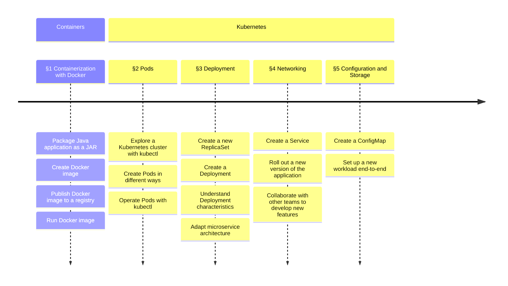


The target readers are students in ESIGELEC.


## Introduction

In modern software development, containers are just everywhere: they are in the continuous integration (CI) system, in the local development environment (devenv), in the production environment with microservices architecture, in the serverless environment, … Understanding the basics of containers becomes an essential skill for any role related to software development. No matter whether you are going to be developers, DevOps, data scientists, project managers, QA, or any other roles, the knowledge of containers can only help you to better fit into the role. It helps you to better understand the needs, better communicate with other professionals and accelerate the development process.

The course lasts for 20 hours. It is broken down into two parts: containerization and orchestration. Containerization refers to the development and operations of a container. Then, the orchestration relates to developing, configuring, and exposing containers in Kubernetes.

## Quick Links

Chapter   |         Date |  Slides | Assignment
:-------- | -----------: | :------ | :---------
Chapter 1 | 20 Oct, 2025 | [slides](/esigelec/2025/1) | [assignment](https://github.com/mincong-classroom/containers/blob/main/docs/lab-1.md)
Chapter 2 | 21 Oct, 2025 | [slides](/esigelec/2025/2) | [assignment](https://github.com/mincong-classroom/containers/blob/main/docs/lab-2.md)
Chapter 3 | 28 Oct, 2025 | [slides](/esigelec/2025/3) | [assignment](https://github.com/mincong-classroom/containers/blob/main/docs/lab-3.md)
Chapter 4 | 29 Oct, 2025 | [slides](/esigelec/2025/4) | [assignment](https://github.com/mincong-classroom/containers/blob/main/docs/lab-4.md)
Chapter 5 | 30 Oct, 2025 | [slides](/esigelec/2025/5) | [assignment](https://github.com/mincong-classroom/containers/blob/main/docs/lab-5.md)

Other resources:

* GitHub: organization [mincong-classroom](https://github.com/mincong-classroom/), classroom invitation <https://classroom.github.com/a/l38CNSR0>
* DockerHub: [mincongclassroom](https://hub.docker.com/u/mincongclassroom)
