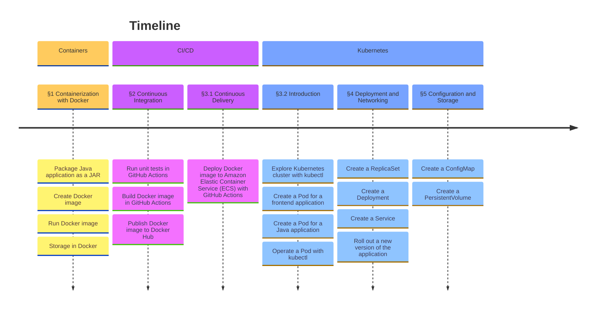


The target readers are students in ESIGELEC.


## Introduction

In modern software development, containers are just everywhere: they are in the continuous integration (CI) system, in the local development environment (devenv), in the production environment with microservices architecture, in the serverless environment, … Understanding the basics of containers becomes an essential skill for any role related to software development. No matter whether you are going to be developers, DevOps, data scientists, project managers, QA, or any other roles, the knowledge of containers can only help you to better fit into the role. It helps you to better understand the needs, better communicate with other professionals and accelerate the development process.

The course will be broken down into 3 parts: containerization, CI/CD, and orchestration. Containerization talks about what a container is and its core concepts. The CI/CD talks about how to build and deploy the container into production. In the end, the orchestration talks about how to operate containers using Kubernetes or similar technologies.

## Quick Links

Chapter | Date |  Slides | Assignment
:--- | ---: | :--- | :---
Chapter 1 | 21 Oct, 2024 | [slides](/esigelec/1/) | [assignment](https://github.com/mincong-classroom/containers/blob/main/docs/lab-1.md)
Chapter 2 | 23 Oct, 2024 | [slides](/esigelec/2/) | [assignment](https://github.com/mincong-classroom/containers/blob/main/docs/lab-2.md)
Chapter 3 | 28 Oct, 2024 | [slides](/esigelec/3/) | [assignment](https://github.com/mincong-classroom/containers/blob/main/docs/lab-3.md)
Chapter 4 | 7 Nov, 2024 | not available yet | [assignment](https://github.com/mincong-classroom/containers/blob/main/docs/lab-4.md)
Chapter 5 | 20 Nov 2024 | not available yet | [assignment](https://github.com/mincong-classroom/containers/blob/main/docs/lab-5.md)

Other resources:

* GitHub: organization [mincong-classroom](https://github.com/mincong-classroom/), classroom invitation <https://classroom.github.com/a/Wo093iKD>
* DockerHub: [mincongclassroom](https://hub.docker.com/u/mincongclassroom)
